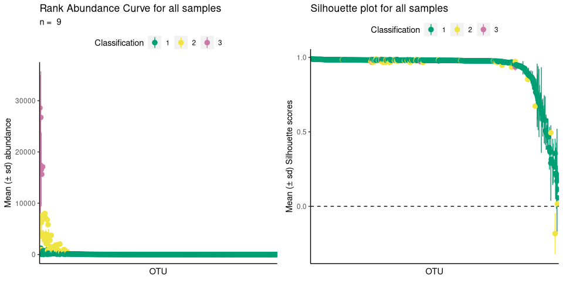
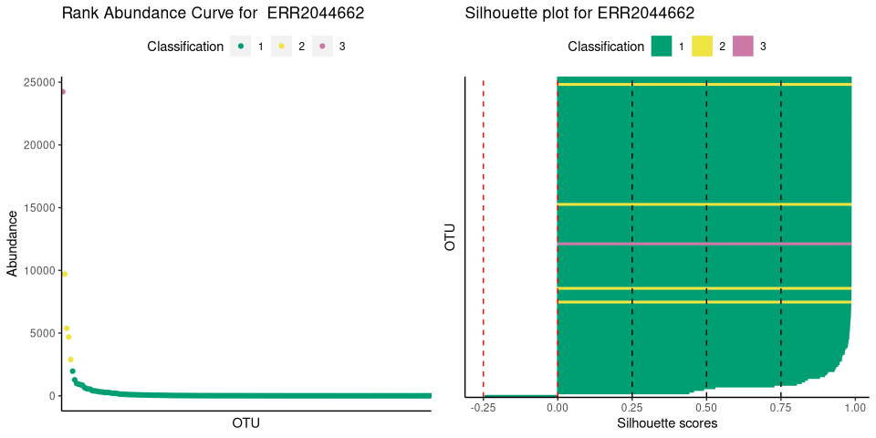

<!-- README.md is generated from README.Rmd. Please edit that file -->

# ulrb

<!-- badges: start -->

[](https://github.com/pascoalf/ulrb/actions/workflows/R-CMD-check.yaml)
[](https://github.com/pascoalf/ulrb/actions/workflows/test-coverage.yaml)
[](http://perso.crans.org/besson/LICENSE.html)

[](https://lifecycle.r-lib.org/articles/stages.html#stable)
<!-- badges: end -->

The R package **ulrb** stands for **Unsupervised Machine Learning
definition of the Rare Biosphere**. As the name suggests, it applies
unsupervised learning principles to define the rare biosphere.

More specifically, the partitioning around medoids (k-medoids) algorithm
is used to divide phylogenetic units (ASVs, OTUs, Species, …) within a
microbial community (usually, a sample) into clusters. The clusters are
then ordered based on a user-defined classification vector. By default,
our method classifies all phylogenetic units in one of these: “rare”,
“undetermined” or “abundant”. In alternative, we provide functions to
help the user decide the number of clusters and we also provide a fully
automated option. Besides clustering, we have functions to help you
evaluate the clustering quality (e.g. silhouette scores).

For detailed theory behind our reasoning for this definition of the
microbial rare biosphere, results and applications, see our paper
Pascoal et al., 2023 (in preparation). For more details on the R
functions used and data wrangling please see the package documentation.

For tutorials and documentation of the **urlb** package, visit our
website: link.

**Note: the article to cite ulrb is in preparation for submission**

## Installation

You can install the development version of ulrb from
[GitHub](https://github.com/) with:

``` r
# install.packages("devtools")
devtools::install_github("pascoalf/ulrb")
```

We are working on a CRAN publication. We will then provide instructions
for CRAN installation.

## Example

This is a basic example which shows you how to use ulrb to divide
phylogenetic units into three classifications (rare, undetermined and
abundant):

``` r
library(ulrb)
## basic example
define_rb(nice_tidy)
#> Joining with `by = join_by(Sample, Level)`
#> # A tibble: 2,177 × 17
#> # Groups:   Sample, Classification [27]
#>    Sample    Classification OTU   Domain Phylum Class Order Family Genus Species
#>    <chr>     <fct>          <chr> <chr>  <chr>  <chr> <chr> <chr>  <chr> <chr>  
#>  1 ERR20446… Rare           OTU_2 sk__A… p__Eu… c__C… <NA>  <NA>   <NA>  <NA>   
#>  2 ERR20446… Rare           OTU_5 sk__A… p__Eu… c__T… <NA>  <NA>   <NA>  <NA>   
#>  3 ERR20446… Rare           OTU_6 sk__A… p__Th… <NA>  <NA>  <NA>   <NA>  <NA>   
#>  4 ERR20446… Rare           OTU_7 sk__A… p__Th… c__   o__   f__    g__C… <NA>   
#>  5 ERR20446… Rare           OTU_8 sk__A… p__Th… c__   o__N… <NA>   <NA>  <NA>   
#>  6 ERR20446… Rare           OTU_… sk__A… p__Th… c__   o__N… f__Ni… g__N… <NA>   
#>  7 ERR20446… Rare           OTU_… sk__B… p__Ac… <NA>  <NA>  <NA>   <NA>  <NA>   
#>  8 ERR20446… Rare           OTU_… sk__B… p__Ac… c__A… o__A… <NA>   <NA>  <NA>   
#>  9 ERR20446… Rare           OTU_… sk__B… p__Ac… <NA>  <NA>  <NA>   <NA>  <NA>   
#> 10 ERR20446… Rare           OTU_… sk__B… p__Ac… c__A… <NA>  <NA>   <NA>  <NA>   
#> # ℹ 2,167 more rows
#> # ℹ 7 more variables: Abundance <int>, pam_object <list>, Level <fct>,
#> #   Silhouette_scores <dbl>, Cluster_median_abundance <dbl>,
#> #   median_Silhouette <dbl>, Evaluation <chr>
```

With ulrb, you can also format your original species table, get an
automatic number of clusters and plot the results:

``` r
# nice is an OTU table in wide format
head(nice)
#>   ERR2044662 ERR2044663 ERR2044664 ERR2044665 ERR2044666 ERR2044667 ERR2044668
#> 1        165        323         51         70        134        216          0
#> 2          0          0          1          0          0          1          0
#> 3          0          0          1          2          2          6          0
#> 4        541       1018        351        115        241       1633        177
#> 5          8          5         41         15         14        146          0
#> 6         15         31        590        133        174       1814         12
#>   ERR2044669 ERR2044670   OTU      Domain            Phylum
#> 1         11          0 OTU_2 sk__Archaea  p__Euryarchaeota
#> 2          0          0 OTU_3 sk__Archaea  p__Euryarchaeota
#> 3          0          0 OTU_4 sk__Archaea  p__Euryarchaeota
#> 4       1371          7 OTU_5 sk__Archaea  p__Euryarchaeota
#> 5         14          0 OTU_6 sk__Archaea p__Thaumarchaeota
#> 6        173          2 OTU_7 sk__Archaea p__Thaumarchaeota
#>                       Class                       Order Family
#> 1 c__Candidatus_Poseidoniia                        <NA>   <NA>
#> 2 c__Candidatus_Poseidoniia o__Candidatus_Poseidoniales    f__
#> 3           c__Halobacteria          o__Halobacteriales   <NA>
#> 4         c__Thermoplasmata                        <NA>   <NA>
#> 5                      <NA>                        <NA>   <NA>
#> 6                       c__                         o__    f__
#>                            Genus                                        Species
#> 1                           <NA>                                           <NA>
#> 2                            g__ s__Marine_group_II_euryarchaeote_REDSEA-S03_B6
#> 3                           <NA>                                           <NA>
#> 4                           <NA>                                           <NA>
#> 5                           <NA>                                           <NA>
#> 6 g__Candidatus_Nitrosopelagicus                                           <NA>

# first, we tidy the "nice" OTU table
sample_names <- c("ERR2044662", "ERR2044663", "ERR2044664",
                   "ERR2044665", "ERR2044666", "ERR2044667",
                   "ERR2044668", "ERR2044669", "ERR2044670")

# If data is in wide format, with samples in cols
nice_tidy <- prepare_tidy_data(nice,
                               sample_names = sample_names,
                               samples_in = "cols")

# second, we apply ulrb algorithm in automatic setting
nice_classification_results <- define_rb(nice_tidy)
#> Joining with `by = join_by(Sample, Level)`

# third, we plot microbial community and the quality of k-medoids clustering
plot_ulrb(nice_classification_results, taxa_col = "OTU", plot_all = TRUE)
#> Warning: Removed 197 rows containing missing values (`geom_segment()`).
#> Removed 197 rows containing missing values (`geom_segment()`).
```



``` r

# In case you want to inspect the result of a particular sample, do:
plot_ulrb(nice_classification_results, taxa_col = "OTU", sample_id = "ERR2044662")
```


