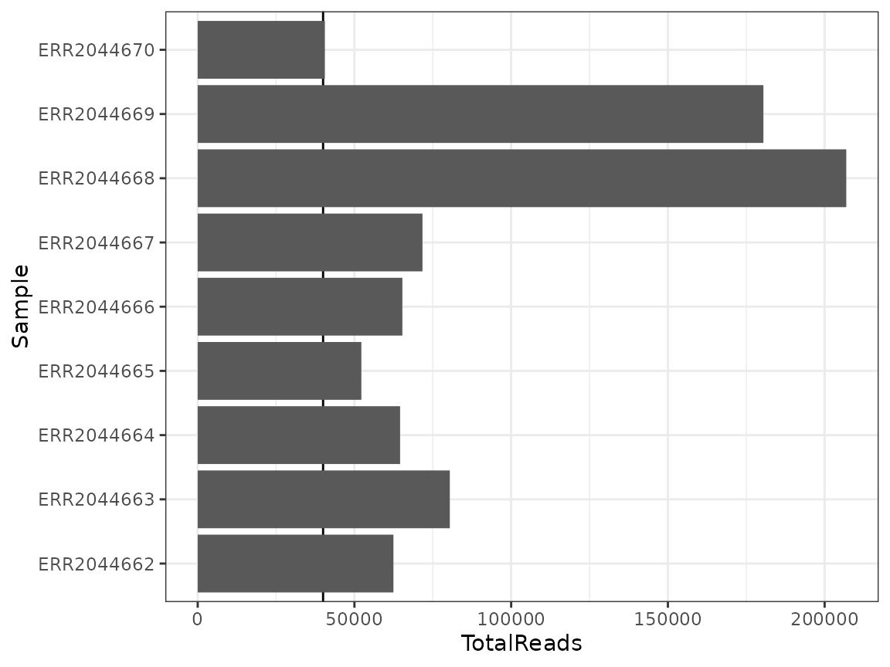
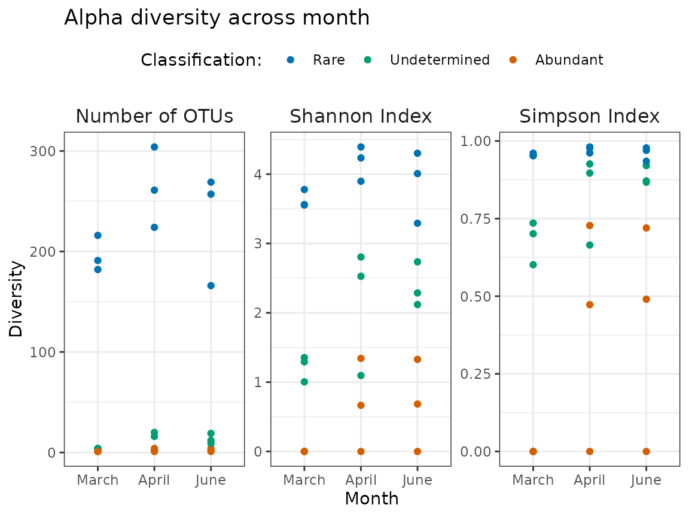
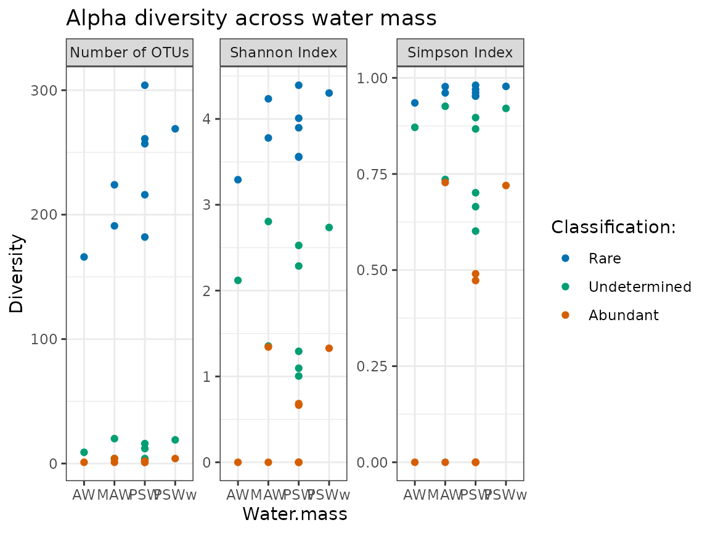
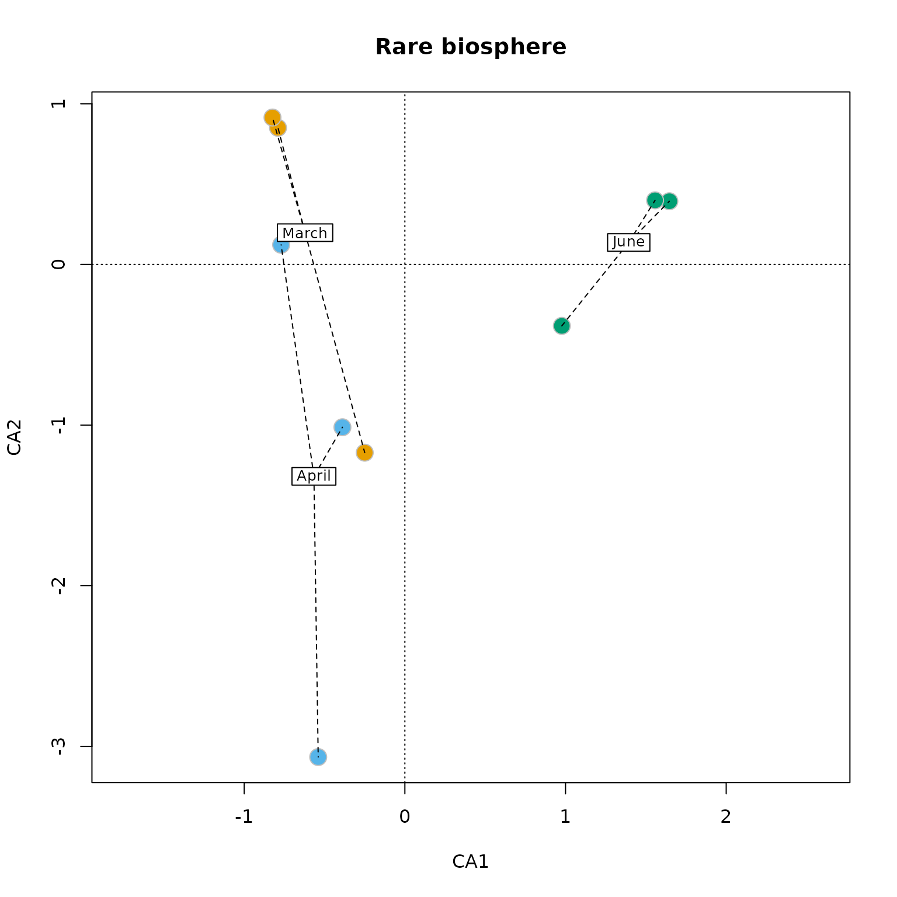

# Integration of ulrb in a simple microbial ecology workflow

## Ecological analysis of microbial rare biosphere defined by ulrb

In this tutorial we will show how the output from
[`define_rb()`](https://pascoalf.github.io/ulrb/reference/define_rb.md)
can be readily used for some common ecological analysis. In this case,
we will just look at alpha diversity.

To do so, we have several steps:

1.  Load and clean OTU table (we just want prokaryotes);
2.  Rarefy samples (we show this option, because it is very common);
3.  Classify OTUs into rare, undetermined or abundant (with
    [`define_rb()`](https://pascoalf.github.io/ulrb/reference/define_rb.md)
    function);
4.  Merge OTU table with metadata information;
5.  Calculate and plot alpha diversity metrics against environmental
    variables.

### Quick overview of N-ICE dataset

The N-ICE dataset consists of 9 samples, collected during the winter to
spring transition of 2015 by fixing the vessel on drifting ice (Granskog
et al., 2018). Samples were collected at various depths (from 5m to
250m) and the ice drifted across different regions, DNA was collected
for 16S amplicon sequencing and metagenomes (de Sousa et al., 2019); and
bioinformatic processing of reads was performed by Mgnify platform (v5)
(Mitchel et al., 2020).

For this tutorial we are using the OTU table downloaded from the link
<https://www.ebi.ac.uk/metagenomics/studies/MGYS00001922#analysis> in
06-01-2023 and focus solely on the 16S amplicon data.

``` r

library(ulrb)
library(dplyr)
#> 
#> Attaching package: 'dplyr'
#> The following objects are masked from 'package:stats':
#> 
#>     filter, lag
#> The following objects are masked from 'package:base':
#> 
#>     intersect, setdiff, setequal, union
library(tidyr)
library(vegan)
#> Loading required package: permute
library(ggplot2)
library(purrr)
#
set.seed(123)
```

### (a) Load and clean OTU table

``` r

# Load raw OTU table from N-ICE
data("nice_raw", package = "ulrb")
data("nice_env", package = "ulrb")

# Change name of first column
nice_clean <- rename(nice_raw, Taxonomy = "X.SampleID")

# Select 16S rRNA amplicon sequencing samples
selected_samples <- c("ERR2044662", "ERR2044663", "ERR2044664",
                      "ERR2044665", "ERR2044666", "ERR2044667",
                      "ERR2044668", "ERR2044669", "ERR2044670")

# Add a column with phylogenetic units ID (OTU in this case)
nice_clean <- mutate(nice_clean, OTU = paste0("OTU_", row_number()))

# Select relevant collumns
nice_clean <- select(nice_clean, selected_samples, OTU, Taxonomy)
#> Warning: Using an external vector in selections was deprecated in tidyselect 1.1.0.
#> ℹ Please use `all_of()` or `any_of()` instead.
#>   # Was:
#>   data %>% select(selected_samples)
#> 
#>   # Now:
#>   data %>% select(all_of(selected_samples))
#> 
#> See <https://tidyselect.r-lib.org/reference/faq-external-vector.html>.
#> This warning is displayed once per session.
#> Call `lifecycle::last_lifecycle_warnings()` to see where this warning was
#> generated.

# Separate Taxonomy column into each taxonomic level
nice_clean <- separate(nice_clean, Taxonomy,
                       c("Domain","Kingdom","Phylum",
                         "Class","Order","Family","Genus","Species"),
                       sep=";")
#> Warning: Expected 8 pieces. Missing pieces filled with `NA` in 912 rows [1, 2, 4, 5, 6,
#> 7, 8, 9, 10, 11, 12, 13, 14, 15, 16, 17, 18, 19, 20, 21, ...].

# Remove Kingdom column, because it is not used for prokaryotes
nice_clean <- select(nice_clean, -Kingdom)

# Remove eukaryotes
nice_clean <- filter(nice_clean, Domain != "sk__Eukaryota")

# Remove unclassified OTUs at phylum level
nice_clean <- filter(nice_clean, !is.na(Phylum))

# Simplify name
nice <- nice_clean

# Check if everything looks normal
head(nice)
#>   ERR2044662 ERR2044663 ERR2044664 ERR2044665 ERR2044666 ERR2044667 ERR2044668
#> 1        165        323         51         70        134        216          0
#> 2          0          0          1          0          0          1          0
#> 3          0          0          1          2          2          6          0
#> 4        541       1018        351        115        241       1633        177
#> 5          8          5         41         15         14        146          0
#> 6         15         31        590        133        174       1814         12
#>   ERR2044669 ERR2044670   OTU      Domain            Phylum
#> 1         11          0 OTU_2 sk__Archaea  p__Euryarchaeota
#> 2          0          0 OTU_3 sk__Archaea  p__Euryarchaeota
#> 3          0          0 OTU_4 sk__Archaea  p__Euryarchaeota
#> 4       1371          7 OTU_5 sk__Archaea  p__Euryarchaeota
#> 5         14          0 OTU_6 sk__Archaea p__Thaumarchaeota
#> 6        173          2 OTU_7 sk__Archaea p__Thaumarchaeota
#>                       Class                       Order Family
#> 1 c__Candidatus_Poseidoniia                        <NA>   <NA>
#> 2 c__Candidatus_Poseidoniia o__Candidatus_Poseidoniales    f__
#> 3           c__Halobacteria          o__Halobacteriales   <NA>
#> 4         c__Thermoplasmata                        <NA>   <NA>
#> 5                      <NA>                        <NA>   <NA>
#> 6                       c__                         o__    f__
#>                            Genus                                        Species
#> 1                           <NA>                                           <NA>
#> 2                            g__ s__Marine_group_II_euryarchaeote_REDSEA-S03_B6
#> 3                           <NA>                                           <NA>
#> 4                           <NA>                                           <NA>
#> 5                           <NA>                                           <NA>
#> 6 g__Candidatus_Nitrosopelagicus                                           <NA>

# Change table to tidy format
# You can automatically do this with an ulrb function
nice_tidy <- prepare_tidy_data(nice, ## data to tidy 
                  sample_names = contains("ERR"), ## vector with ID samples
                  samples_in = "cols") ## samples can be in columns (cols) or rows. 
```

### (b) Rarefy samples

Now that we have a tidy table, it will be important to keep in mind how
the data is organized. In this tutorial, we will be using functions like
[`group_by()`](https://dplyr.tidyverse.org/reference/group_by.html) or
[`nest()`](https://tidyr.tidyverse.org/reference/nest.html), if you are
not familiarized with them, try to search for tidyverse packages,
functions and mindset. We are also going to use the package vegan, which
can be used for most ecology statistics. Note, however, that vegan works
with matrices in very specific formats, so hopefully this sections will
also help you to see how you can use tidy verse approaches to very
specific data types.

The first step will be to verify how many reads each sample got

``` r

## First, check how many reads each sample got
nice_tidy %>% 
  group_by(Sample) %>% ## because data is in tidy format
  summarise(TotalReads = sum(Abundance)) %>% 
  ggplot(aes(Sample, TotalReads)) + 
  geom_hline(yintercept = 40000) + 
  geom_col() + 
  theme_bw() + 
  coord_flip()
```



All samples have more than about 50 000 reads, with one sample having a
little bit less. But we think we can keep all samples and rarefy down to
40 000 reads.

``` r

nice_rarefid <- 
  nice_tidy %>% 
  group_by(Sample) %>%
  nest() %>% 
  mutate(Rarefied_reads = map(.x = data, 
                              ~as.data.frame(
                                t(
                                  rrarefy(
                                    .x$Abundance, 
                                    sample = 40000))))) %>% 
  unnest(c(data,Rarefied_reads))%>% 
  rename(Rarefied_abundance = "V1")  
```

### (b) Classify OTUs into rare, undetermined or abundant (with `define_rb()` function);

At this stage, we can simply apply the
[`define_rb()`](https://pascoalf.github.io/ulrb/reference/define_rb.md)
function, which will include a nesting and grouping step inside of
itself. For this reason, the data does not need to be grouped before the
function. During unit testing, however, we noticed that this could
introduce problems, so the function implicitly removes any grouping of
the tidy table used by the author. This way, only the pre-specific
grouping of the function is used. To have control over this, you just
need to be careful with the sample column, because ulrb method assumes
that the calculations are made “by sample” – so, it will do an
[`ungroup()`](https://dplyr.tidyverse.org/reference/group_by.html)
followed by `group_by(Sample)`.

In practice, this is very simple:

``` r

nice_classified <- define_rb(nice_tidy, simplified = TRUE)
#> Joining with `by = join_by(Sample, Level)`
head(nice_classified)
#> # A tibble: 6 × 17
#> # Groups:   Sample, Classification [1]
#>   Sample     Classification OTU   Domain Phylum Class Order Family Genus Species
#>   <chr>      <fct>          <chr> <chr>  <chr>  <chr> <chr> <chr>  <chr> <chr>  
#> 1 ERR2044662 Rare           OTU_2 sk__A… p__Eu… c__C… NA    NA     NA    NA     
#> 2 ERR2044662 Rare           OTU_5 sk__A… p__Eu… c__T… NA    NA     NA    NA     
#> 3 ERR2044662 Rare           OTU_6 sk__A… p__Th… NA    NA    NA     NA    NA     
#> 4 ERR2044662 Rare           OTU_7 sk__A… p__Th… c__   o__   f__    g__C… NA     
#> 5 ERR2044662 Rare           OTU_8 sk__A… p__Th… c__   o__N… NA     NA    NA     
#> 6 ERR2044662 Rare           OTU_… sk__A… p__Th… c__   o__N… f__Ni… g__N… NA     
#> # ℹ 7 more variables: Abundance <int>, pam_object <list>, Level <fct>,
#> #   Silhouette_scores <dbl>, Cluster_median_abundance <dbl>,
#> #   median_Silhouette <dbl>, Evaluation <chr>
```

By default, the function can give lots of details, but in this case,
since we are just going to look at the ecology component, and not at the
machine learning aspects of this, we can set the argument *simplified*
to `TRUE`. Note that the additional computational time required for the
additional details should be negligible for small datasets (we don’t
know how it behaves for bigger datasets).

### (c) Merge OTU table with metadata information

We are almost ready to analyze ecological questions, but first we need
metadata. All we have to do is merge our classified OTU table with the
metadata table. To do this we will use join functions from dplyr, just
note that the sample ID from the two tables that we want to merge are
different, but this is easy to solve.

``` r

nice_eco <- nice_classified %>% left_join(nice_env, by = c("Sample" = "ENA_ID"))
```

### (e) Calculate and plot diversity metrics against environmental variables.

At this point, we can calculate some common alpha diversity metrics. If
we use the dplyr and ggplot functions, then it becomes really easy to
make a simple overview of prokaryotic diversity, by classification.

``` r

# Calculate diversity
nice_diversity <- nice_eco %>% 
  group_by(Sample, Classification, Month, Depth, Water.mass) %>% 
  summarise(SpeciesRichness = specnumber(Abundance),
            ShannonIndex = diversity(Abundance, index = "shannon"),
            SimpsonIndex = diversity(Abundance, index = "simpson")) %>% 
  ungroup()
#> `summarise()` has regrouped the output.
#> ℹ Summaries were computed grouped by Sample, Classification, Month, Depth, and
#>   Water.mass.
#> ℹ Output is grouped by Sample, Classification, Month, and Depth.
#> ℹ Use `summarise(.groups = "drop_last")` to silence this message.
#> ℹ Use `summarise(.by = c(Sample, Classification, Month, Depth, Water.mass))`
#>   for per-operation grouping (`?dplyr::dplyr_by`) instead.
```

``` r

## Re-organize table to have all diversity indices in a single col.
nice_diversity_tidy <- nice_diversity %>% 
  pivot_longer(cols = c("SpeciesRichness", "ShannonIndex", "SimpsonIndex"),
               names_to = "Index",
               values_to = "Diversity") %>% 
# correct order
  mutate(Month = factor(Month, levels = c("March", "April", "June"))) %>% 
# edit diversity index names
  mutate(Index = case_when(Index == "ShannonIndex" ~ "Shannon Index",
                           Index == "SimpsonIndex" ~ "Simpson Index",
                           TRUE ~ "Number of OTUs")) %>%
  # order diversity index names
  mutate(Index = factor(Index, c("Number of OTUs", "Shannon Index","Simpson Index")))
```

#### Alpha diversity plots

At this stage, we have everything in a single tidy data.frame, which
makes ggplot plots straightforward.

- Month variation

``` r

qualitative_colors <- 
  c("#E69F00", "#56B4E9", "#009E73", "#F0E442", "#0072B2", "#D55E00", "#CC79A7")

## Plots
nice_diversity_tidy %>%
  ggplot(aes(Month, Diversity, col = Classification)) + 
  geom_point() + 
  facet_wrap(~Index, scales = "free_y")+
  scale_color_manual(values = qualitative_colors[c(5,3,6)]) + 
  theme_bw() + 
  theme(strip.background = element_blank(),
        strip.text = element_text(size = 12),
        legend.position = "top") + 
  labs(col = "Classification: ",
       title = "Alpha diversity across month")
```



- Water mass variation

``` r

nice_diversity_tidy %>% 
  ggplot(aes(Water.mass, Diversity, col = Classification)) + 
  geom_point() + 
  facet_wrap(~Index, scales = "free_y")+
  scale_color_manual(values = qualitative_colors[c(5,3,6)]) + 
  theme_bw() + 
  theme(strip.background = element_blank(),
        strip.text = element_text(size = 12),
        legend.position = "top") +
  labs(col = "Classification: ",
       title = "Alpha diversity across water mass")
```



#### Beta diversity

We can also do some basic beta diversity. Note that it might require a
little bit more of data wrangling.

In this section, we will only focus on the rare biosphere.

- Months

``` r

rare_biosphere <- 
  nice_eco %>%  
  filter(Classification == "Rare") %>% 
  select(Sample, Abundance, OTU, Depth, Month, Water.mass) %>% 
  mutate(Sample_unique = paste(Sample, Month))
#> Adding missing grouping variables: `Classification`

rb_env <- rare_biosphere %>% 
  ungroup() %>% 
  select(Sample_unique, Depth, Water.mass, Month) %>% 
  distinct()

rb_sp_prep <- rare_biosphere %>% 
  ungroup() %>% 
  select(Sample_unique, Abundance, OTU)

rb_sp_prep %>% head() # sanity check
#> # A tibble: 6 × 3
#>   Sample_unique    Abundance OTU   
#>   <chr>                <int> <chr> 
#> 1 ERR2044662 March       165 OTU_2 
#> 2 ERR2044662 March       541 OTU_5 
#> 3 ERR2044662 March         8 OTU_6 
#> 4 ERR2044662 March        15 OTU_7 
#> 5 ERR2044662 March         5 OTU_8 
#> 6 ERR2044662 March         4 OTU_10

rb_sp <- 
  rb_sp_prep %>% 
  tidyr::pivot_wider(names_from = "OTU",
                     values_from = "Abundance",
                     values_fn = list(count= list)) %>% 
  print() %>% 
  unchop(everything())
#> # A tibble: 9 × 523
#>   Sample_unique OTU_2 OTU_5 OTU_6 OTU_7 OTU_8 OTU_10 OTU_15 OTU_17 OTU_21 OTU_22
#>   <chr>         <int> <int> <int> <int> <int>  <int>  <int>  <int>  <int>  <int>
#> 1 ERR2044662 M…   165   541     8    15     5      4     19      1     61    123
#> 2 ERR2044663 M…   323  1018     5    31    10      2     30      1     83    296
#> 3 ERR2044664 M…    51   351    41   590     7     24    377     NA      2    209
#> 4 ERR2044665 A…    70   115    15   133     3     11    102      1     30    308
#> 5 ERR2044666 A…   134   241    14   174    10     10     83      1     48    405
#> 6 ERR2044667 A…   216    NA   146    NA    16    136     NA     NA      5     NA
#> 7 ERR2044669 J…    11    NA    14   173     8     12     19      2    108    183
#> 8 ERR2044668 J…    NA   177    NA    12    NA     NA      4      2    132    165
#> 9 ERR2044670 J…    NA     7    NA     2    NA     NA      1      1     12     12
#> # ℹ 512 more variables: OTU_23 <int>, OTU_26 <int>, OTU_29 <int>, OTU_30 <int>,
#> #   OTU_31 <int>, OTU_39 <int>, OTU_40 <int>, OTU_44 <int>, OTU_47 <int>,
#> #   OTU_48 <int>, OTU_57 <int>, OTU_58 <int>, OTU_66 <int>, OTU_70 <int>,
#> #   OTU_76 <int>, OTU_89 <int>, OTU_91 <int>, OTU_92 <int>, OTU_95 <int>,
#> #   OTU_97 <int>, OTU_99 <int>, OTU_100 <int>, OTU_101 <int>, OTU_103 <int>,
#> #   OTU_104 <int>, OTU_105 <int>, OTU_106 <int>, OTU_108 <int>, OTU_110 <int>,
#> #   OTU_120 <int>, OTU_121 <int>, OTU_122 <int>, OTU_128 <int>, …
```

``` r

rb_sp[is.na(rb_sp)] <- 0

# Prepare aesthetics
rb_env <- rb_env %>% 
  mutate(col_month = case_when(Month == "March" ~ qualitative_colors[1],
                               Month == "April" ~ qualitative_colors[2],
                               TRUE ~ qualitative_colors[3])) %>% 
  mutate()
```

``` r

cca_plot_rare_biosphere <- 
  cca(rb_sp[,-1], display = "sites", scale = TRUE) %>% 
  plot(display = "sites", type = "p", main = "Rare biosphere")
#
cca_plot_rare_biosphere
#> $sites
#>          CA1        CA2
#> 1 -0.7896653  0.8503868
#> 2 -0.8239607  0.9143530
#> 3 -0.2497625 -1.1717369
#> 4 -0.3886150 -1.0134637
#> 5 -0.7702444  0.1222861
#> 6 -0.5394403 -3.0662464
#> 7  0.9769221 -0.3825371
#> 8  1.6462283  0.3933325
#> 9  1.5573013  0.3989370
#> 
#> attr(,"class")
#> [1] "ordiplot"
points(cca_plot_rare_biosphere,
       bg = rb_env$col_month,
       pch = 21, 
       col = "grey", 
       cex = 2)
#
with(rb_env,
     ordispider(cca_plot_rare_biosphere,
                Month, lty = "dashed", label = TRUE))
```



From this analysis, it seems that the community composition of the rare
biosphere is different between June and the remaining months.

## Final considerations

Hopefully, you got a sense of how the ulrb package can be integrated in
a more general microbial ecology workflow. Of course, many more
questions could be approached, such as taxonomy and so on. This was
meant to serve as an example of how ulrb can be trivially integrated in
a data analysis workflow.

## References

- de Sousa, A. G. G., Tomasino, M. P., Duarte, P., Fernández-Méndez, M.,
  Assmy, P., Ribeiro, H., Surkont, J., Leite, R. B., Pereira-Leal, J.
  B., Torgo, L., & Magalhães, C. (2019). Diversity and Composition of
  Pelagic Prokaryotic and Protist Communities in a Thin Arctic Sea-Ice
  Regime. Microbial Ecology, 78(2), 388–408.

- Mitchell, A. L., Almeida, A., Beracochea, M., Boland, M., Burgin, J.,
  Cochrane, G., Crusoe, M. R., Kale, V., Potter, S. C., Richardson, L.
  J., Sakharova, E., Scheremetjew, M., Korobeynikov, A., Shlemov, A.,
  Kunyavskaya, O., Lapidus, A., & Finn, R. D. (2019). MGnify: the
  microbiome analysis resource in 2020. Nucleic Acids Research, 48(D1),
  D570–D578.

- Granskog, M. A., Fer, I., Rinke, A., & Steen, H. (2018).
  Atmosphere-Ice-Ocean-Ecosystem Processes in a Thinner Arctic Sea Ice
  Regime: The Norwegian Young Sea ICE (N-ICE2015) Expedition. Journal of
  Geophysical Research: Oceans, 123(3), 1586–1594.
