# Alternative classifications with ulrb

``` r

library(ulrb)
library(cluster)
library(dplyr)
#> 
#> Attaching package: 'dplyr'
#> The following objects are masked from 'package:stats':
#> 
#>     filter, lag
#> The following objects are masked from 'package:base':
#> 
#>     intersect, setdiff, setequal, union
library(ggplot2)
library(tidyr)
# a vector with some colors
qualitative_colors <- c("#E69F00", "#56B4E9", "#009E73", "#F0E442", "#0072B2", "#D55E00", "#CC79A7", "grey50")
```

## Explore alternative classifications

By default, we have been considering that the microbial communities are
divided into “rare”, “undetermined” and “abundant”. This division
implies that the partition around medoids algorithm is considering
**k=3**, *i.e.* there are three clusters. However, there are at least
three situations where you might want to change the number of clusters:

1.  The clusters obtained are non-sense;
2.  The biological/ecological questions requires another division;
3.  You want a fully automated classification.

There might be other situations, of course. The bottom line is that,
depending on the context of your specific research and data, you might
just want a different number of classifications. We propose 3 and we
think that 3 different classifications work well for most situations,
but this is not set in stone.

In this tutorial we will show how
[`define_rb()`](https://pascoalf.github.io/ulrb/reference/define_rb.md)
can be used for different classifications and we will also try and go a
little bit deeper on whats behind the actual function.

## Index

1.  Classical example;

2.  Apply 2 classifications: Rare vs Abundant;

3.  Apply more complicated classification, k\>3;

4.  Why k = 1 is non-sense;

5.  What is the maximum number of k and why?;

6.  Approaches to evaluate k;

7.  Set k automatically.

### Classical example

The classical example will simply use the default arguments with the
function
[`define_rb()`](https://pascoalf.github.io/ulrb/reference/define_rb.md).

#### Prepare data

Just like in the tutorial
[`vignette("ulrb-vignet")`](https://pascoalf.github.io/ulrb/articles/ulrb-vignet.md),
we have to import, clean and tidy the dataset before using the
[`define_rb()`](https://pascoalf.github.io/ulrb/reference/define_rb.md)
function.

``` r

# Load raw OTU table from N-ICE
data("nice_raw", package = "ulrb")

# Change name of first column
nice_clean <- rename(nice_raw, Taxonomy = "X.SampleID")

# Select 16S rRNA amplicon sequencing samples
selected_samples <- c("ERR2044662", "ERR2044663", "ERR2044664",
                      "ERR2044665", "ERR2044666", "ERR2044667",
                      "ERR2044668", "ERR2044669", "ERR2044670")

# Add a column with phylogenetic units ID (OTU in this case)
nice_clean <- mutate(nice_clean, OTU = paste0("OTU_", row_number()))

# Select relevant collumns
nice_clean <- select(nice_clean, selected_samples, OTU, Taxonomy)
#> Warning: Using an external vector in selections was deprecated in tidyselect 1.1.0.
#> ℹ Please use `all_of()` or `any_of()` instead.
#>   # Was:
#>   data %>% select(selected_samples)
#> 
#>   # Now:
#>   data %>% select(all_of(selected_samples))
#> 
#> See <https://tidyselect.r-lib.org/reference/faq-external-vector.html>.
#> This warning is displayed once per session.
#> Call `lifecycle::last_lifecycle_warnings()` to see where this warning was
#> generated.

# Separate Taxonomy column into each taxonomic level
nice_clean <- separate(nice_clean, 
                       Taxonomy,
                       c("Domain","Kingdom","Phylum",
                         "Class","Order","Family",
                         "Genus","Species"), 
                       sep=";")
#> Warning: Expected 8 pieces. Missing pieces filled with `NA` in 912 rows [1, 2, 4, 5, 6,
#> 7, 8, 9, 10, 11, 12, 13, 14, 15, 16, 17, 18, 19, 20, 21, ...].

# Remove Kingdom column, because it is not used for prokaryotes
nice_clean <- select(nice_clean, -Kingdom)

# Remove eukaryotes
nice_clean <- filter(nice_clean, Domain != "sk__Eukaryota")

# Remove unclassified OTUs at phylum level
nice_clean <- filter(nice_clean, !is.na(Phylum))

# Simplify name
nice <- nice_clean

# Tidy data
nice_tidy <- prepare_tidy_data(nice, 
                               sample_names = selected_samples, 
                               samples_in = "cols")
```

#### Default is k = 3

The default settings can be interpreted as the division between “rare”,
“undetermined” and “abundant” species.

``` r

rb_default <- define_rb(nice_tidy)
#> Joining with `by = join_by(Sample, Level)`
```

We can see the meaning of this division with the standard Rank Abundance
Curve (RAC).

Let’s start with a single sample:

``` r

plot_ulrb_clustering(rb_default, 
                     sample_id = "ERR2044662",
                     taxa_col = "OTU",
                     log_scaled = TRUE)
#> Warning in plot_ulrb_clustering(rb_default, sample_id = "ERR2044662", taxa_col
#> = "OTU", : If you want to plot only ERR2044662 use plot_all = FALSE
```

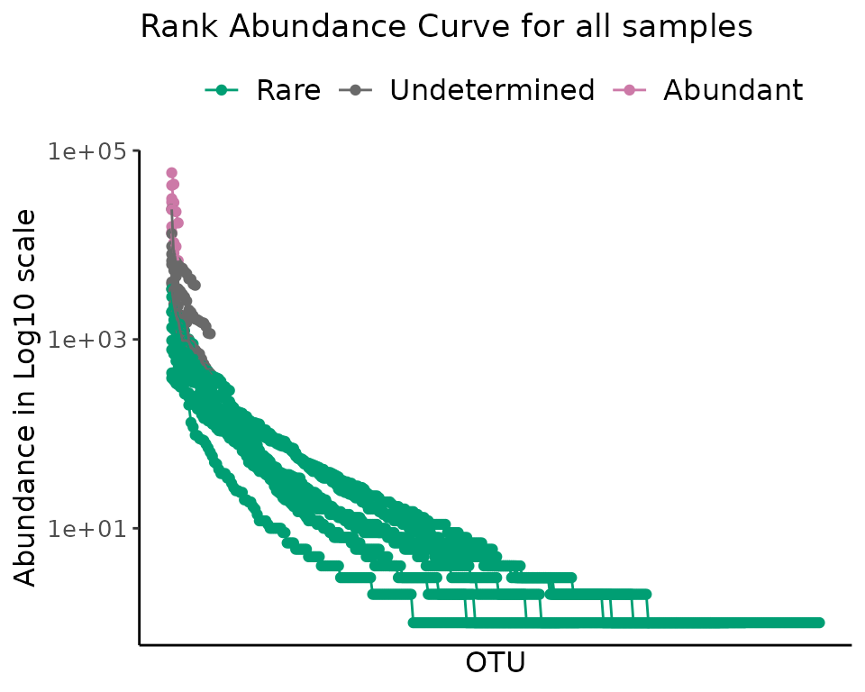

To look at all samples at once, we use a centrality metric. Note that
for a low number of samples you can chose to use a grid, or plot all
samples; but this wont work for a high number of samples. With a
centrality metric, however, we are able to see any number of samples in
a single plot.

``` r

plot_ulrb_clustering(rb_default, 
                     taxa_col = "OTU",
                     log_scaled = TRUE,
                     plot_all = TRUE)
```

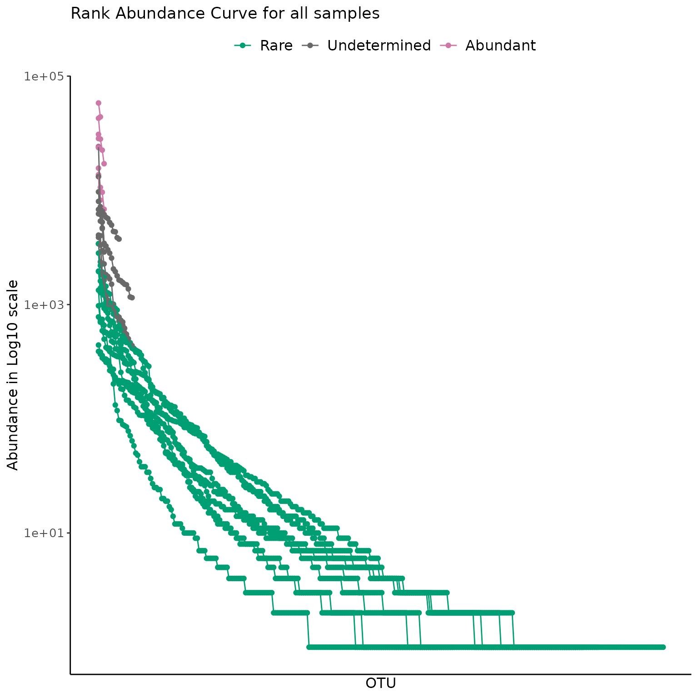

### Apply 2 classifications: Rare vs Abundant

We can do exactly the same thing we did before, but with only “rare” and
“abundant” classifications, to do that we set k = 2. Note that we do not
explicitly set k = 2 in the
[`define_rb()`](https://pascoalf.github.io/ulrb/reference/define_rb.md)
function, instead, we specify our **classification vector**.

The classification vector can be anything, but in the context of k = 2,
our meaning is that we have “rare” and “abundant” species; but you could
call them “class1” and “class2”, or whatever you want. Behind the
scenes, the function
[`define_rb()`](https://pascoalf.github.io/ulrb/reference/define_rb.md)
will calculate the size of your classification vector and from there
estimate k. So, if you have a classification vector with “rare” and
“abundant”, it will have length 2, so k = 2; Likewise, the default
parameter is set to classification_vector = c(“Rare”, “Undetermined”,
“Abundant”), so length = 3 and k = 3.

To apply this new classification scheme we change the
`classification_vector` argument:

``` r

rb_k2 <- define_rb(nice_tidy, classification_vector = c("Rare", "Abundant"))
#> Joining with `by = join_by(Sample, Level)`
```

And then we can see the clustering result just like before.

``` r

plot_ulrb_clustering(rb_k2,
                     taxa_col = "OTU",
                     plot_all = TRUE, 
                     log_scaled = TRUE, 
                     colors = c("#009E73", "#F0E442"))
```

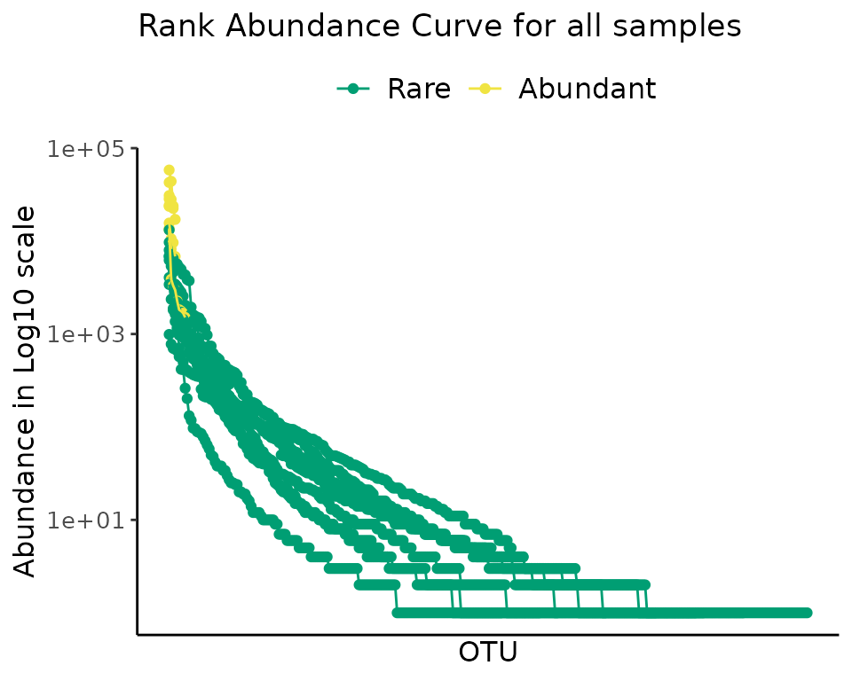

And we can compare the two options directly:

``` r

gridExtra::grid.arrange(
  plot_ulrb_clustering(rb_default, 
                     taxa_col = "OTU",
                     log_scaled = TRUE,
                     plot_all = TRUE),
  plot_ulrb_clustering(rb_k2,
                     taxa_col = "OTU",
                     plot_all = TRUE, 
                     log_scaled = TRUE, 
                     colors = c("#009E73", "#F0E442")),
  nrow = 1
)
```

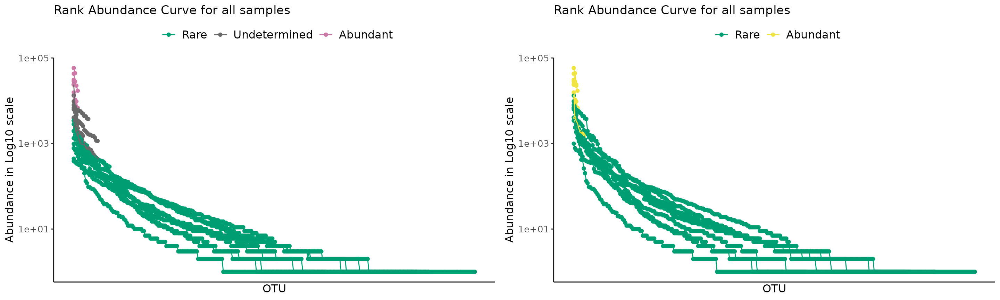

We do not recommend using k = 2, because it implies that there is a hard
distinction between rare and abundant taxa. We consider that there
should always be an intermediate or undetermined group, otherwise, we
will always have phylogenetic units with very similar abundance scores,
but opposing classifications, which is misleading. For more details on
this reasoning, see Pascoal et al., 2025.

### Apply more complicated classification, k\>3

Lets suppose that we want to distinguish our microbial community into
the following groups:

(*e.g.* A) 1) very rare; 2) rare; 3) abundant; 4) very abundant.

Or:

(*e.g.* B) 1) very rare; 2) rare; 4) undetermined; 5) abundant; 6) very
abundant.

Or even more…

Hopefully, you get the idea, the point is that we just have to change
the classification vector.

Lets see how we would do *e.g.* A. First we select a new classification
vector, which will have 4 different classifications, thus (implicitly) k
= 4.

``` r

#
rb_k4 <- define_rb(nice_tidy, 
                   classification_vector = c("very rare", "rare", "abundant", "very abundant"))
#> Joining with `by = join_by(Sample, Level)`
#
```

``` r

# One sample as example
plot_ulrb(rb_k4,
          sample_id = "ERR2044662", 
          taxa_col = "OTU",
          colors = c("#009E73", "#F0E442", "grey","#CC79A7"),
          log_scaled = TRUE)
#> Warning in plot_ulrb_clustering(data, sample_id = sample_id, taxa_col =
#> taxa_col, : If you want to plot only ERR2044662 use plot_all = FALSE
#> Classification label might not fit, consider changing the plot.
#> Warning in plot_ulrb_silhouette(data, sample_id = sample_id, taxa_col =
#> taxa_col, : If you want to plot only ERR2044662 use plot_all = FALSE
#> Classification label might not fit, consider changing the plot.
```

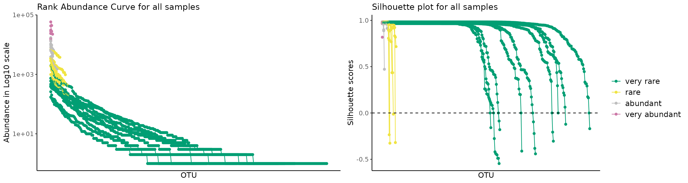

``` r

# all samples
plot_ulrb(rb_k4,
          taxa_col = "OTU",
          colors = c("#009E73", "#F0E442", "grey","#CC79A7"),
          log_scaled = TRUE,
          plot_all = TRUE)
#> Classification label might not fit, consider changing the plot.
#> Classification label might not fit, consider changing the plot.
```

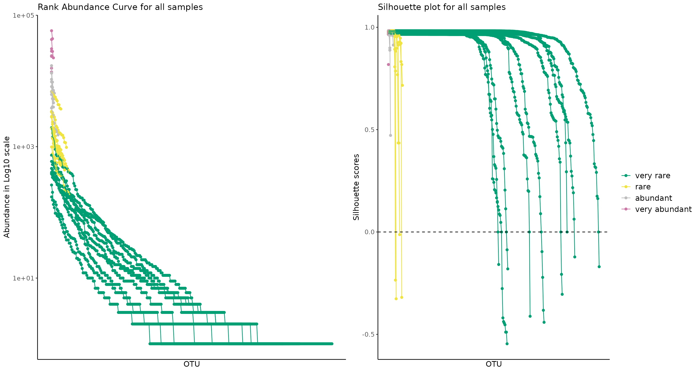

Note that this is a very acceptable interpretation of the data!

Hopefully you already have the intuition to change classifications as
you wish. Let’s do the *e.g.* B, which has k = 5, because it includes 5
different classifications.

``` r

#
rb_k5 <- define_rb(nice_tidy, 
                   classification_vector = c("very rare", "rare", "undetermined", "abundant", "very abundant"))
#> Joining with `by = join_by(Sample, Level)`
```

``` r

# One sample as example
plot_ulrb(rb_k5,
          sample_id = "ERR2044662", 
          taxa_col = "OTU",
          colors = qualitative_colors[1:5],
          log_scaled = TRUE)
#> Warning in plot_ulrb_clustering(data, sample_id = sample_id, taxa_col =
#> taxa_col, : If you want to plot only ERR2044662 use plot_all = FALSE
#> Classification label might not fit, consider changing the plot.
#> Warning in plot_ulrb_silhouette(data, sample_id = sample_id, taxa_col =
#> taxa_col, : If you want to plot only ERR2044662 use plot_all = FALSE
#> Classification label might not fit, consider changing the plot.
```

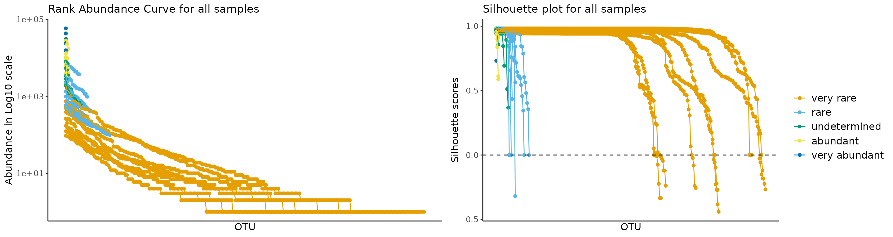

``` r

# All samples
plot_ulrb(rb_k5,
          taxa_col = "OTU",
          colors = qualitative_colors[1:5],
          log_scaled = TRUE,
          plot_all = TRUE)
#> Classification label might not fit, consider changing the plot.
#> Classification label might not fit, consider changing the plot.
```

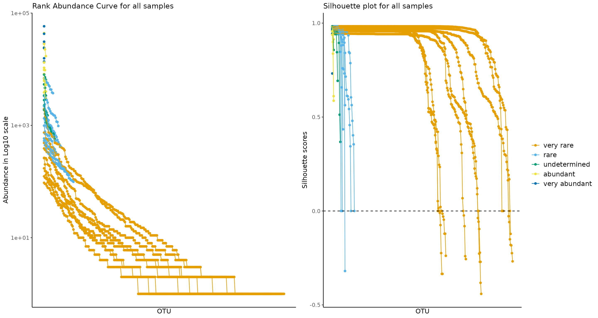

### Why k = 1 is non-sense

Some values of k are (mathematically) possible, but non-sense. Consider,
for example, **k = 1**. In this situation, it is perfectly possible from
a mathematical point of view, *i.e* you simply cluster all observations
into a single classification. However, this is meaningless and gives no
extra information on your community. Additionally, from the point of
view of the rare biosphere, it is important to keep in mind that one
phylogenetic unit can only be considered “rare” **relatively** to the
other phylogenetic units within the same community. Thus, in this
context, **k = 1 is self-contradictory**. Despite this, do keep in mind
that we are making the assumption that there is such thing as a “rare
biosphere”. This naive assumption caries another assumption within
itself, which is that phylogenetic units have sufficiently different
abundance relative to one another to form distinct clusters. In fact, I
don’t think anyone as found an environmental microbial community
constituted of phylogenetic units with the exactly (or approximately)
same abundance score. If that was the case, then we could not say that a
species was neither rare or abundant, because any classification would
be self-contradictory.

We can do the same thing as before, setting the classification vector to
just “rare” and you’ll see how it is possible, but meaningless.

``` r

#
rb_k1 <- define_rb(nice_tidy, classification_vector = c("rare"))
#> Joining with `by = join_by(Sample, Level)`
```

``` r

plot_ulrb_clustering(rb_k1, 
                     taxa_col = "OTU", 
                     colors = "green4", 
                     plot_all = TRUE, 
                     log_scaled = TRUE)
```

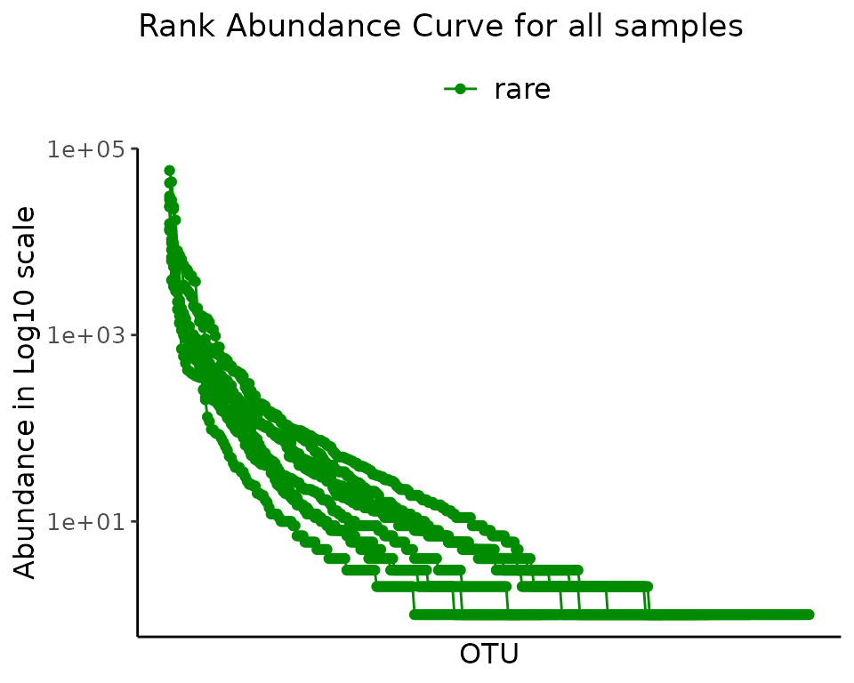
\## What is the maximum value of k and why?

What about the maximum value of k? This is set by the limitations
inherent to algorithm itself, which in this case is partition around
medoids (k-medoids). The maximum number of groups on which we divide
observations must be less than the total observations. Meaning that at
the maximum limit, each possible observation is its own group. This
means that it could be possible to have a maximum value of k equal to
the number of different phylogenetic units, *i.e.* each phylogenetic
unit has its own classification. However, if you try to do that, you
will get an error. This is because several phylogenetic units have
exactly the same abundance, specially in the rare biosphere. Thus, those
phylogenetic units can never belong to different classifications (if we
are separating phylogenetic units by their abundance, then phylogenetic
units with the same abundance must belong to the same group). This means
that the maximum value of k will be equal to number of **different**
abundance scores, which will be lower than the number of total
observations.

If you have several samples, then the maximum value of k will differ for
each sample (even if you apply normalization). If you would apply the
same maximum k for all samples at once, then you would have to calculate
the maximum k of all samples, and then select the minimum of those,
which will be the one working for all.

Just like with k = 1, the maximum value of k is meaningless. Even if you
do it, which you mathematically can, it will not give you any additional
information.

Lets illustrate the maximum k of one sample:

``` r

rb_sample1 <- nice_tidy %>% filter(Sample == "ERR2044662")

# Calculate maximum k
max_k_sample1 <- rb_sample1 %>% pull(Abundance) %>% unique() %>% length()
#
max_k_sample1
#> [1] 71
# Improvise a classification vector for maximum k
# that is just any vector with the same length
classification_vector_max_k_sample1 <- seq_along(1:max_k_sample1)
#
rb_sample1_max_k <- 
  define_rb(rb_sample1,
            classification_vector = classification_vector_max_k_sample1)
#> Joining with `by = join_by(Sample, Level)`
#> Warning in define_rb(rb_sample1, classification_vector =
#> classification_vector_max_k_sample1): 0 samples got bad average Silhouette
#> score.
#> Within 0 bad samples, there were 25 clusters with bad average Silhouette score.
#> If half the observations within a classification are below 0.5 Silhouette score, we consider that the clustering was 'Bad'.
#> Check 'Evaluation' collumn for more details.
#
rb_sample1_max_k %>% select(OTU, Classification, Abundance) %>% head(10)
#> Adding missing grouping variables: `Sample`
#> # A tibble: 10 × 4
#> # Groups:   Sample, Classification [3]
#>    Sample     OTU     Classification Abundance
#>    <chr>      <chr>   <fct>              <int>
#>  1 ERR2044662 OTU_2   44                   165
#>  2 ERR2044662 OTU_5   58                   541
#>  3 ERR2044662 OTU_6   8                      8
#>  4 ERR2044662 OTU_29  8                      8
#>  5 ERR2044662 OTU_30  8                      8
#>  6 ERR2044662 OTU_244 8                      8
#>  7 ERR2044662 OTU_260 8                      8
#>  8 ERR2044662 OTU_313 8                      8
#>  9 ERR2044662 OTU_329 8                      8
#> 10 ERR2044662 OTU_380 8                      8
```

I’m not going to plot this figure, because I would need 71 different
colors! There really is no point, this was just to show you that it is
possible. With some data wrangling you could easily do the same for all
samples, or any number of samples. But this is really not something that
you should ever do in the context of rare biosphere studies.

### Approaches to evaluate k

What if we want to compare all possible values of k? Or, if not all of
them, just a few candidates?

To compare values of k, there are a few useful metrics that are
implemented in ulrb package:

- Average Silhouette score (cluster density);
- Davies-Bouldin index (cluster separation);
- And Calinski-Harabasz index (cluster definition).

Each of these metrics evaluates different aspects of one clustering
result; thus, we can calculate them for the clustering obtained by each
value of k. By comparing the values obtained for each k, you can select
the k that got the best score. To do this, consider the following:

- Average Silhouette Score: Select **maximum** value for best k;
- Davies-Bouldin index: Select **minimum** value for best k;  
- Calinski-Harabasz index: Select **maximum** value for best k.

The most straight forward way to evaluate a reasonable range of k’s is
by using the function
[`suggest_k()`](https://pascoalf.github.io/ulrb/reference/suggest_k.md).
This function includes an argument for detailed results, which will give
you the results for the three indices, between k = 3 and k = 10. We
don’t recommend testing k’s outside of this range for the purpose of
defining the rare biosphere, but you can analyze all possible k’s (just
change the range argument).

``` r

suggest_k(nice_tidy, detailed = TRUE)  
#> [[1]]
#> [1] "This list contains several details that might help you decide a k parameter."
#> 
#> [[2]]
#>                      Score                 Criteria                     Details
#> 1     Davies-Bouldin index Minimum value for best k Measures cluster separation
#> 2  Calinski-Harabasz index Maximum value for best k Measures cluster definition
#> 3 Average Silhouette Score Maximum value for best k    Measures cluster density
#> 
#> $SamplesSummary
#> [1] "You study has 9 samples. For each one we calculated all indices obtained for each k, from 2 to 10"
#> 
#> $DaviesBouldin
#> # A tibble: 9 × 3
#>   Sample          CH     k
#>   <chr>        <dbl> <int>
#> 1 ERR2044662  30332.    10
#> 2 ERR2044663  42150.    10
#> 3 ERR2044664 296091.    10
#> 4 ERR2044665  31908.    10
#> 5 ERR2044666  88804.    10
#> 6 ERR2044667  17792.    10
#> 7 ERR2044669  35405.    10
#> 8 ERR2044668  75615.    10
#> 9 ERR2044670  18276.     9
#> 
#> $CalinskiHarabasz
#> # A tibble: 9 × 3
#>   Sample          CH     k
#>   <chr>        <dbl> <int>
#> 1 ERR2044662  30332.    10
#> 2 ERR2044663  42150.    10
#> 3 ERR2044664 296091.    10
#> 4 ERR2044665  31908.    10
#> 5 ERR2044666  88804.    10
#> 6 ERR2044667  17792.    10
#> 7 ERR2044669  35405.    10
#> 8 ERR2044668  75615.    10
#> 9 ERR2044670  18276.     9
#> 
#> $averageSilhouette
#> # A tibble: 9 × 3
#>   Sample     average_Silhouette     k
#>   <chr>                   <dbl> <int>
#> 1 ERR2044662              0.977     2
#> 2 ERR2044663              0.978     2
#> 3 ERR2044664              0.984     2
#> 4 ERR2044665              0.979     2
#> 5 ERR2044666              0.983     2
#> 6 ERR2044667              0.972     2
#> 7 ERR2044669              0.976     2
#> 8 ERR2044668              0.979     2
#> 9 ERR2044670              0.932     3
```

For another group of k’s, range = 10:20

``` r

suggest_k(nice_tidy, detailed = TRUE, range = 10:20)  
#> [[1]]
#> [1] "This list contains several details that might help you decide a k parameter."
#> 
#> [[2]]
#>                      Score                 Criteria                     Details
#> 1     Davies-Bouldin index Minimum value for best k Measures cluster separation
#> 2  Calinski-Harabasz index Maximum value for best k Measures cluster definition
#> 3 Average Silhouette Score Maximum value for best k    Measures cluster density
#> 
#> $SamplesSummary
#> [1] "You study has 9 samples. For each one we calculated all indices obtained for each k, from 10 to 20"
#> 
#> $DaviesBouldin
#> # A tibble: 9 × 3
#>   Sample           CH     k
#>   <chr>         <dbl> <int>
#> 1 ERR2044662  234158.    20
#> 2 ERR2044663  302032.    20
#> 3 ERR2044664 2004343.    20
#> 4 ERR2044665  230118.    20
#> 5 ERR2044666  316479.    20
#> 6 ERR2044667  190069.    20
#> 7 ERR2044669  183647.    19
#> 8 ERR2044668  418496.    18
#> 9 ERR2044670  212691.    19
#> 
#> $CalinskiHarabasz
#> # A tibble: 9 × 3
#>   Sample           CH     k
#>   <chr>         <dbl> <int>
#> 1 ERR2044662  234158.    20
#> 2 ERR2044663  302032.    20
#> 3 ERR2044664 2004343.    20
#> 4 ERR2044665  230118.    20
#> 5 ERR2044666  316479.    20
#> 6 ERR2044667  190069.    20
#> 7 ERR2044669  183647.    19
#> 8 ERR2044668  418496.    18
#> 9 ERR2044670  212691.    19
#> 
#> $averageSilhouette
#> # A tibble: 9 × 3
#>   Sample     average_Silhouette     k
#>   <chr>                   <dbl> <int>
#> 1 ERR2044662              0.770    10
#> 2 ERR2044663              0.800    12
#> 3 ERR2044664              0.773    10
#> 4 ERR2044665              0.789    11
#> 5 ERR2044666              0.781    10
#> 6 ERR2044667              0.791    11
#> 7 ERR2044669              0.748    12
#> 8 ERR2044668              0.799    13
#> 9 ERR2044670              0.747    14
```

#### Fine grained analysis

You can look at particular metrics and at specific samples. To do so, we
made several helper functions:

- [`check_avgSil()`](https://pascoalf.github.io/ulrb/reference/check_avgSil.md)
  to calculate average silhouette score;
- [`check_DB()`](https://pascoalf.github.io/ulrb/reference/check_DB.md)
  to calculate Davies-Bouldin index;
- [`check_CH()`](https://pascoalf.github.io/ulrb/reference/check_CH.md)to
  calculate Calinski-Harabasz index.

You can also calculate them at the same time for one sample with
[`evaluate_sample_k()`](https://pascoalf.github.io/ulrb/reference/evaluate_sample_k.md)
or all samples with
[`evaluate_k()`](https://pascoalf.github.io/ulrb/reference/evaluate_k.md).

Let’s look at several examples, using the default range of k = 2 up to k
= 10:

``` r

## One sample
# To get values
check_avgSil(nice_tidy, sample_id = selected_samples[1])
#> [1] 0.9770110 0.9521452 0.8820316 0.8561774 0.8398216 0.8479872 0.7843358
#> [8] 0.7740169 0.7701163

# To plot results
check_avgSil(nice_tidy, sample_id = selected_samples[1], with_plot = TRUE)
```

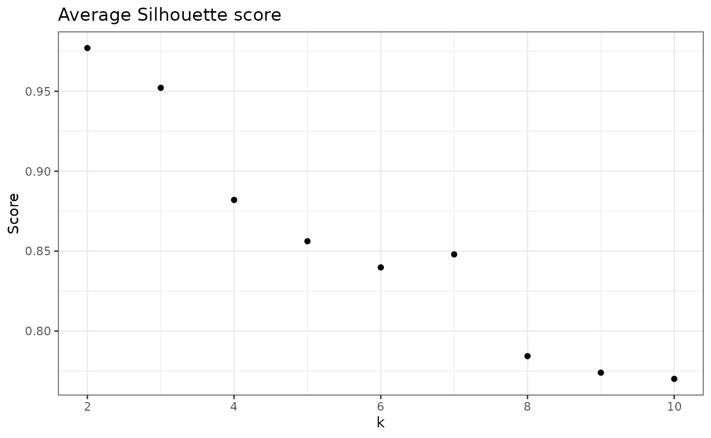

In the last plot, each value of k represents a clustering result. From
the above information, we would select k = 2 (default option), because
it had the highest average Silhouette score.

We can repeat for all other indices:

``` r

## Davie-Boulding index
# To get values
check_DB(nice_tidy, sample_id = selected_samples[1])
#> [1] 0.03821785 0.37218659 0.52717038 0.41316515 0.42926962 0.33508359 0.38929657
#> [8] 0.39480258 0.32944506

# To plot results
check_DB(nice_tidy, sample_id = selected_samples[1], with_plot = TRUE)
```

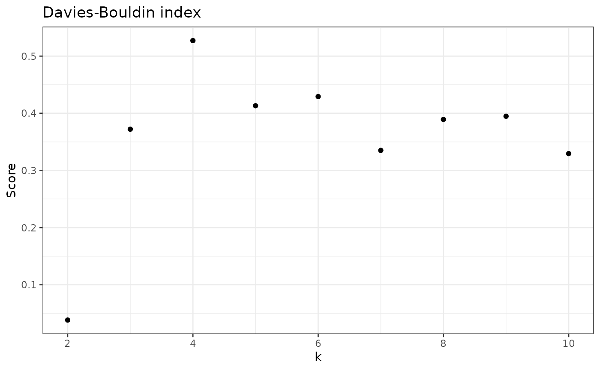

``` r


## Calinski-Harabasz index
# To get values
check_CH(nice_tidy, sample_id = selected_samples[1])
#> [1]   677.3258  1821.4258  2054.8869  4933.9560  5465.1344 17589.0320 17179.8092
#> [8] 18083.3126 30332.3447

# To plot results
check_CH(nice_tidy, sample_id = selected_samples[1], with_plot = TRUE)
```

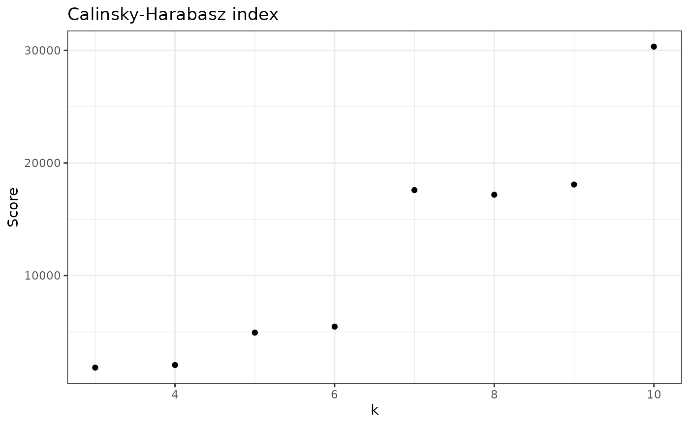

Note that the best k changed depending on the metric selected.

Thus, for sample 1 (ERR2044662), the best k would be: - 3 based on
average Silhouette scores; - 4 based on Davies-Bouldin index; - 10 based
on Calinski-Harabasz index.

We can see how they compare directly with
[`evaluate_sample_k()`](https://pascoalf.github.io/ulrb/reference/evaluate_sample_k.md):

``` r

evaluate_sample_k(nice_tidy, sample_id = selected_samples[1], with_plot = TRUE)
```

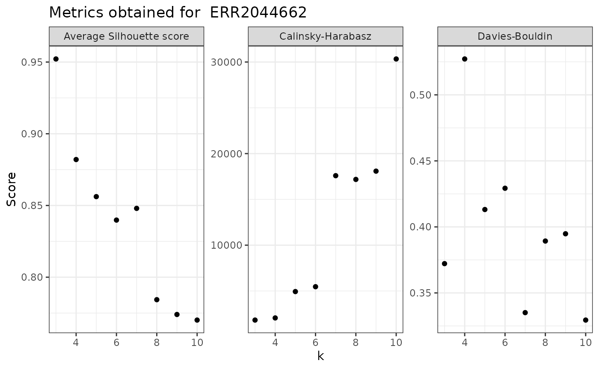

The ulrb method assumes that samples are independent from each other,
which means that the above results for one sample, will be different for
the other samples. Thus, we should look at all samples at the same time,
with centrality metrics. To do so, we can use the function
[`evaluate_k()`](https://pascoalf.github.io/ulrb/reference/evaluate_k.md):

``` r

## To get values
evaluate_k(nice_tidy)
#> # A tibble: 81 × 6
#> # Groups:   Sample [9]
#>    Sample     data                    DB     CH average_Silhouette     k
#>    <chr>      <list>               <dbl>  <dbl>              <dbl> <int>
#>  1 ERR2044662 <tibble [187 × 10]> 0.0382   677.              0.977     2
#>  2 ERR2044662 <tibble [187 × 10]> 0.372   1821.              0.952     3
#>  3 ERR2044662 <tibble [187 × 10]> 0.527   2055.              0.882     4
#>  4 ERR2044662 <tibble [187 × 10]> 0.413   4934.              0.856     5
#>  5 ERR2044662 <tibble [187 × 10]> 0.429   5465.              0.840     6
#>  6 ERR2044662 <tibble [187 × 10]> 0.335  17589.              0.848     7
#>  7 ERR2044662 <tibble [187 × 10]> 0.389  17180.              0.784     8
#>  8 ERR2044662 <tibble [187 × 10]> 0.395  18083.              0.774     9
#>  9 ERR2044662 <tibble [187 × 10]> 0.329  30332.              0.770    10
#> 10 ERR2044663 <tibble [220 × 10]> 0.0390   650.              0.978     2
#> # ℹ 71 more rows

## To plot
evaluate_k(nice_tidy, with_plot = TRUE)
#> No summary function supplied, defaulting to `mean_se()`
```

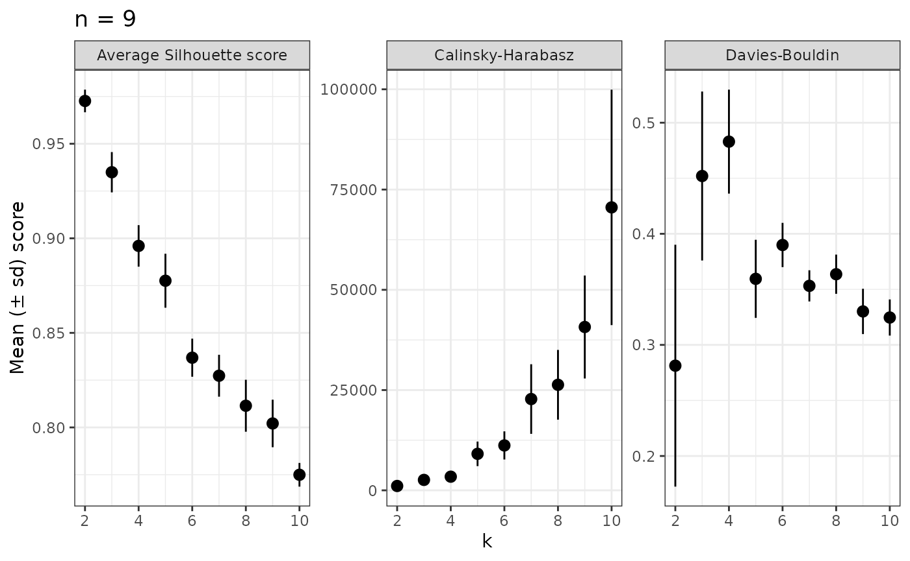

### Automatic k selection

We can decide what k to use based on any of this metrics, being aware
that they measure different aspects of the clustering results. The
function
[`suggest_k()`](https://pascoalf.github.io/ulrb/reference/suggest_k.md),
by default, will:

- calculate the best k, based on the average Silhouette score, for
  **each sample**;
- calculate the average best k across all samples;
- return best k as an integer.

Thus, the default output of
[`suggest_k()`](https://pascoalf.github.io/ulrb/reference/suggest_k.md)
is a single integer; this is used in the
[`define_rb()`](https://pascoalf.github.io/ulrb/reference/define_rb.md)
function for the automatic k decision.

Instead of the average Silhouette score, you can select another index
(Davies-Bouldin or Calinski-Harabasz), and the function
[`suggest_k()`](https://pascoalf.github.io/ulrb/reference/suggest_k.md)
will return the best k based on that index.

Let’s see some examples:

``` r

# default option with average Silhouette score
suggest_k(nice_tidy)
#> [1] 2

# best k for Davies-Bouldin
suggest_k(nice_tidy, index = "Davies-Bouldin")
#> [1] 4

# best k for Calinski-Harabasz
suggest_k(nice_tidy, index = "Calinski-Harabasz")
#> [1] 9
```

### Everything automatic

Finally, if we have the ability to automatically suggest the value of k,
we can do the same in the context of the definition of rarity. To so do,
you can use the default parameters in
[`define_rb()`](https://pascoalf.github.io/ulrb/reference/define_rb.md),
but with the automatic argument set to TRUE.

Like so,

``` r

automatic_classification <- define_rb(nice_tidy, automatic = TRUE)
#> Automatic option set to TRUE, so classification vector was overwritten
#> K= 2 based on Average Silhouette Score.
#> Joining with `by = join_by(Sample, Level)`
# Plot automatic result

plot_ulrb(automatic_classification, 
          taxa_col = "OTU", 
          plot_all = TRUE,
          colors = qualitative_colors[1:2])
```

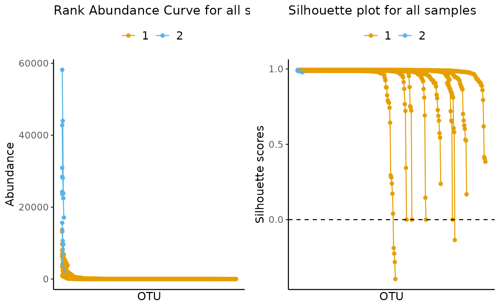

Naturally, you can decide more parameters for the automatic selection of
k, for example, lets suppose that you want to have groups of
phylogenetic units that are very well defined, but you also want to
have, at least, four classifications, but no more than 6.

For those two conditions, you would have to specify the range of k
values (4:6) and the evaluation index should be the Calinski-Harabasz
index:

``` r

more_complex_automatic_classification <- define_rb(nice_tidy, 
                                                   automatic = TRUE,
                                                   index = "Calinski-Harabasz",
                                                   range = 4:6)
#> Automatic option set to TRUE, so classification vector was overwritten
#> K= 5 based on Calinski-Harabasz.
#> Joining with `by = join_by(Sample, Level)`
```

Note that the function informed you that the automatic k selected was 5.
Thus, you know you will need 5 colors for the standard ulrb plots:

``` r

# Plot automatic result
plot_ulrb(more_complex_automatic_classification, 
          plot_all = TRUE, 
          taxa_col = "OTU", 
          colors = qualitative_colors[1:5],
          log_scaled = TRUE)
#> Classification label might not fit, consider changing the plot.
#> Classification label might not fit, consider changing the plot.
```

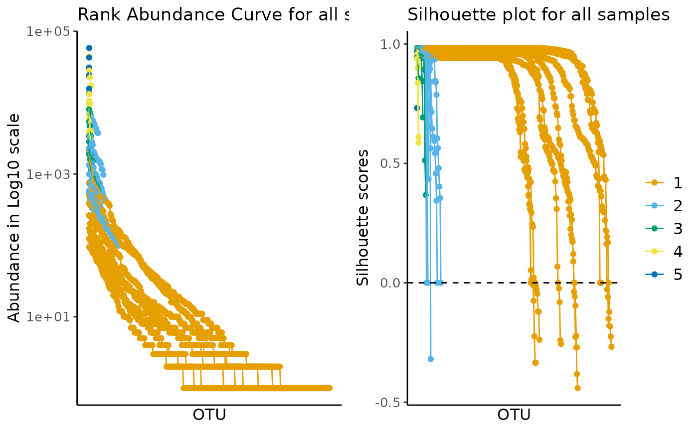

In this example, the automatic option did not seem to give a better
result than the default k = 3.

### How each index behaves across all possible values of k?

This last section is for completion sake and should not be necessary in
a study of the rare biosphere; however, it might prove useful for those
interested in the details of this unsupervised learning approach.

``` r

# Start by deciding the maximum range across the entire dataset
max_k <- nice_tidy %>%
    filter(Abundance > 0, !is.na(Abundance)) %>%
    group_by(Sample) %>%
    summarise(topK = length(unique(Abundance))) %>%
    ungroup() %>%
    pull(topK) %>%
    min()
# print maximum number of clusters allowed for all samples in the N-ICE dataset
max_k
#> [1] 55
```

If we have the maximum k, we just need to use the
[`evaluate_k()`](https://pascoalf.github.io/ulrb/reference/evaluate_k.md)
function for the full range of values.

*note*: the next code chunk might take a while to run.

``` r

evaluate_k(nice_tidy, with_plot = TRUE, range = 2:max_k)
#> No summary function supplied, defaulting to `mean_se()`
#> Warning: Removed 1 row containing non-finite outside the scale range
#> (`stat_summary()`).
```

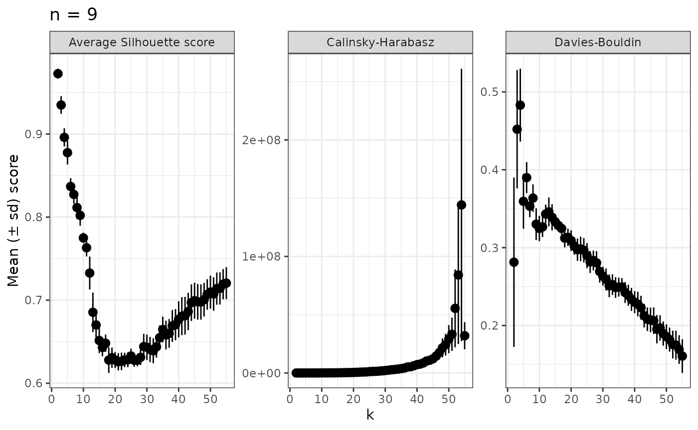

## References

Pascoal, F., Branco, P., Torgo, L. et al. Definition of the microbial
rare biosphere through unsupervised machine learning. Commun Biol 8, 544
(2025). <https://doi.org/10.1038/s42003-025-07912-4>
