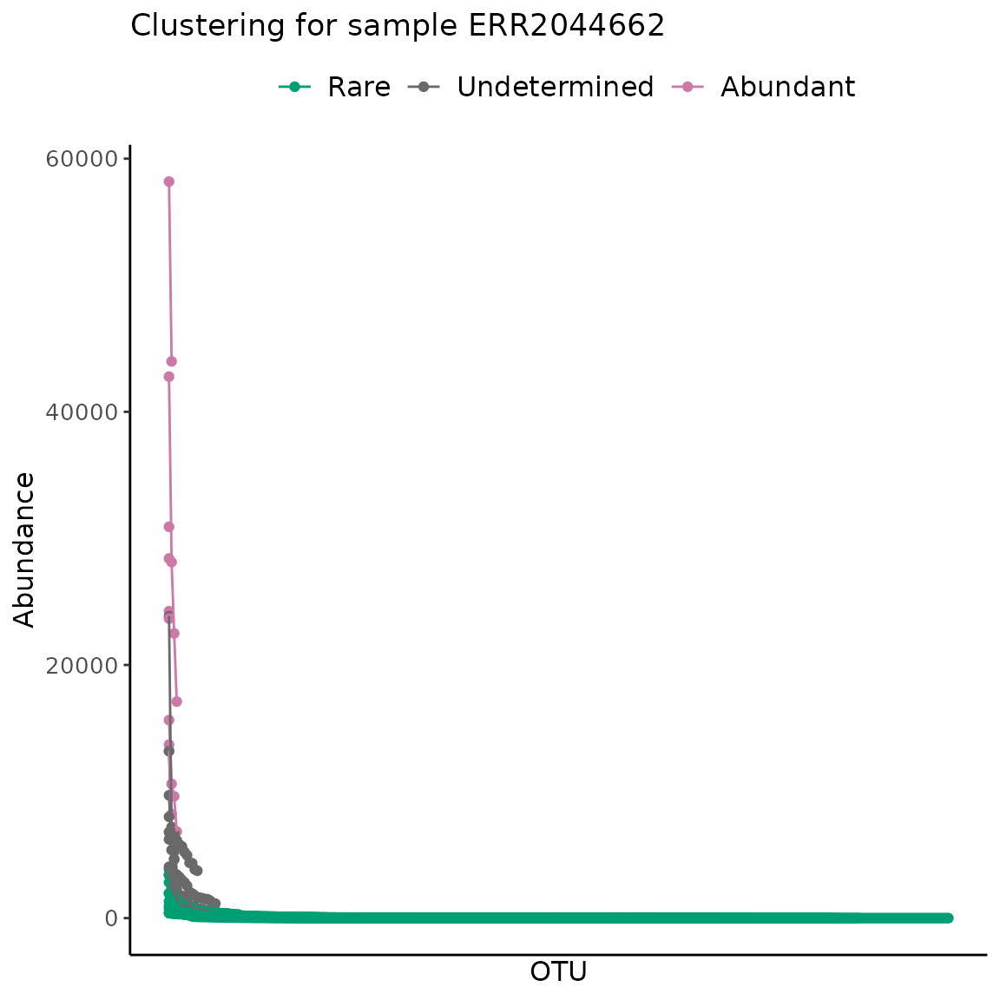
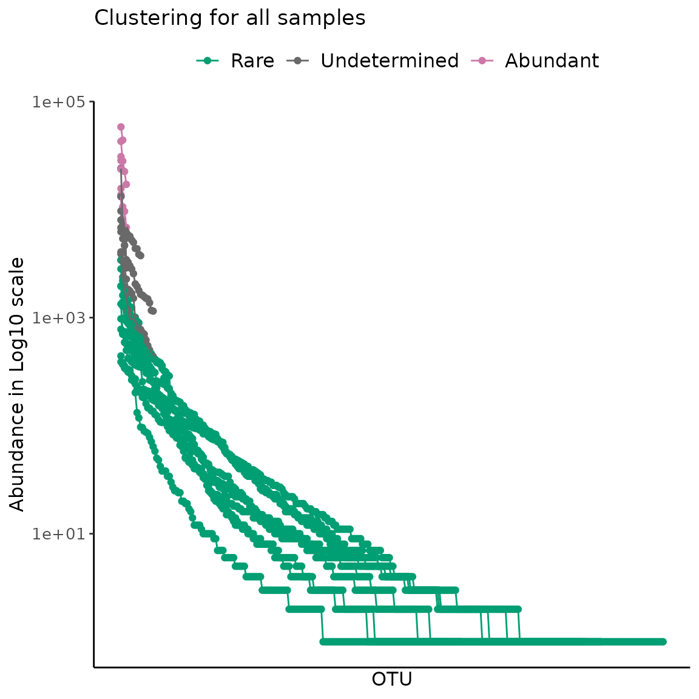
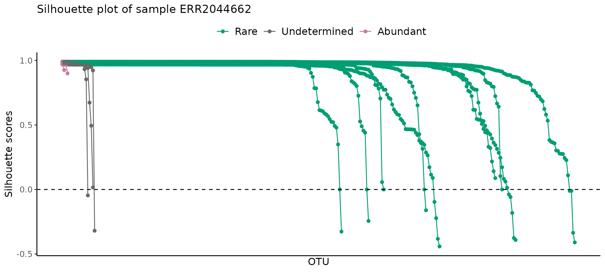
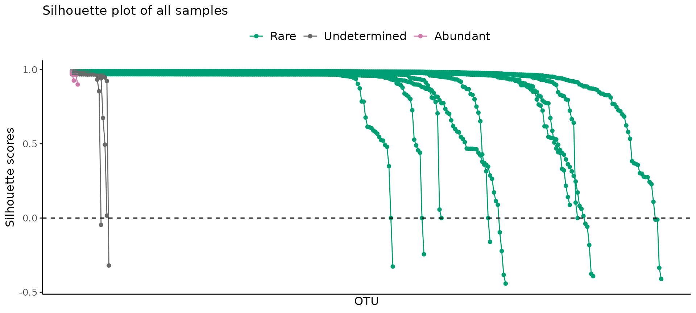
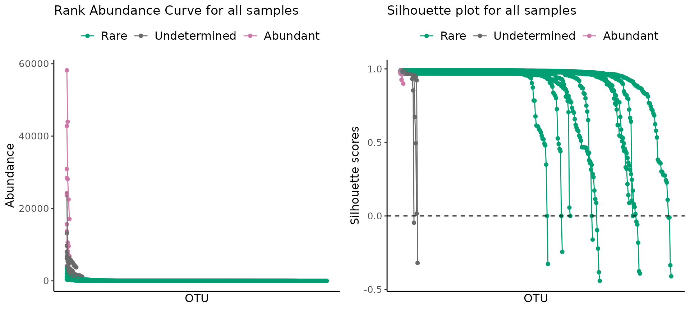

# Tutorial to define rare biosphere with ulrb

## Unsupervised Learning Based Definition Of Microbial Rare Biosphere

The R package ulrb solves the problem of the definition of rarity by
replacing human decision with an unsupervised machine learning algorithm
(partitioning around medoids, k-medoids). This algorithm works for any
type of microbiome data, provided there is an abundance score for each
phylogenetic unit. For validation of this method to several kinds of
molecular data and environments, please see Pascoal et al., 2025.
Preliminary results indicate that this method works for oter biological
systems, provided there is an abundance table.

In this tutorial we will illustrate how to define the microbial rare
biosphere with a small, publicly available dataset, the Norwegian Young
Sea Ice Expedition, 2016 (N-ICE). The molecular data will be from
amplicon sequencing of 16S rRNA gene (for sequencing details, see Sousa
et al., 2019), raw sequences are available in the European Nucleotide
Archive (ENA) under accession number ERP024265, and they were processed
into OTUs by MGnify (Mitchell et al.,2019).

The N-ICE dataset consists of 9 samples, collected during the winter to
spring transition of 2015 by fixing the vessel on drifting ice (Granskog
et al., 2018). Samples were collected at various depths (from 5m to
250m) and the ice drifted across different regions, DNA was collected
for 16S amplicon sequencing and metagenomes (de Sousa et al., 2019); and
bioinformatic processing of reads was performed by Mgnify platform (v5)
(Mitchel et al., 2020).

For this tutorial we are using the OTU table downloaded from the link
<https://www.ebi.ac.uk/metagenomics/studies/MGYS00001922#analysis> in
06-01-2023 and focus solely on the 16S amplicon data.

``` r

library(ulrb)
library(dplyr)
#> 
#> Attaching package: 'dplyr'
#> The following objects are masked from 'package:stats':
#> 
#>     filter, lag
#> The following objects are masked from 'package:base':
#> 
#>     intersect, setdiff, setequal, union
library(tidyr)
library(ggplot2)
```

#### Brief note on nomenclature

We use the term “phylogenetic units” to refer to the highest resolution,
distinct unit identified. This can be species, OTU, ASV, …

We use the term “abundance table” to refer to the table with, at least,
the abundance score for each phylogenetic unit. Any additional data can
be added, this can be an OTU table, ASV table…

We also use the term “scale” or “scaling”, which can also appear in the
literature as “normalization”, “transformation”, …

### Pre-processing of data prior to clustering algorithm

The package ulrb will require that the abundance table is in tidy (or
long) format, with a column for the abundance score used and another
column for samples. Any additional columns are allowed.

**Regarding the abundance score**, we are not scaling the abundance
score in this vignette, because the k-medoids algorithm will be applied
“per sample” to the values of the abundance score. This means that any
scaling, *e.g.* relative abundance, center log-ratio, … Will not have an
effect on the algorithm, because the distance values between
observations will remain the same. However, if the algorithm was applied
to more variables (not only abundance), then scaling could make a
difference. Thus, we consider that it is best to use absolute values in
this tutorial, to avoid misleading the reader into thinking that some
scaling has to be done.

Notwithstanding, for publication purposes and for the purposes of other
data processing steps, it might make sense to apply some sort of
scaling. As long as the number of observations, *i.e.* the number of
phylogenetic units, is the same, then the distance between them will be
the same.

If the user decides to apply any quality filtering to the abundance
table, like rarefaction, it should be done **before** using the
clustering method.

In summary, the algorithm will be applied to your final, clean abundance
table, with any abundance score.

#### Load and clean abundance table

``` r

# Load raw OTU table from N-ICE
data("nice_raw", package = "ulrb")

# Change name of first column
nice_clean <- rename(nice_raw, Taxonomy = "X.SampleID")

# Select 16S rRNA amplicon sequencing samples
selected_samples <- c("ERR2044662", "ERR2044663", "ERR2044664","ERR2044665", "ERR2044666", "ERR2044667","ERR2044668", "ERR2044669", "ERR2044670")

# Add a column with phylogenetic units ID (OTU in this case)
nice_clean <- mutate(nice_clean, OTU = paste0("OTU_", row_number()))

# Select relevant columns
nice_clean <- select(nice_clean, selected_samples, OTU, Taxonomy)
#> Warning: Using an external vector in selections was deprecated in tidyselect 1.1.0.
#> ℹ Please use `all_of()` or `any_of()` instead.
#>   # Was:
#>   data %>% select(selected_samples)
#> 
#>   # Now:
#>   data %>% select(all_of(selected_samples))
#> 
#> See <https://tidyselect.r-lib.org/reference/faq-external-vector.html>.
#> This warning is displayed once per session.
#> Call `lifecycle::last_lifecycle_warnings()` to see where this warning was
#> generated.

# Separate Taxonomy column into each taxonomic level
nice_clean <- separate(nice_clean, Taxonomy, c("Domain","Kingdom","Phylum","Class","Order","Family","Genus","Species"),sep=";")
#> Warning: Expected 8 pieces. Missing pieces filled with `NA` in 912 rows [1, 2, 4, 5, 6,
#> 7, 8, 9, 10, 11, 12, 13, 14, 15, 16, 17, 18, 19, 20, 21, ...].

# Remove Kingdom column, because it is not used for prokaryotes
nice_clean <- select(nice_clean, -Kingdom)

# Remove eukaryotes
nice_clean <- filter(nice_clean, Domain != "sk__Eukaryota")

# Remove unclassified OTUs at phylum level
nice_clean <- filter(nice_clean, !is.na(Phylum))

# Simplify name
nice <- nice_clean

# Quick look at the table
head(nice)
#>   ERR2044662 ERR2044663 ERR2044664 ERR2044665 ERR2044666 ERR2044667 ERR2044668
#> 1        165        323         51         70        134        216          0
#> 2          0          0          1          0          0          1          0
#> 3          0          0          1          2          2          6          0
#> 4        541       1018        351        115        241       1633        177
#> 5          8          5         41         15         14        146          0
#> 6         15         31        590        133        174       1814         12
#>   ERR2044669 ERR2044670   OTU      Domain            Phylum
#> 1         11          0 OTU_2 sk__Archaea  p__Euryarchaeota
#> 2          0          0 OTU_3 sk__Archaea  p__Euryarchaeota
#> 3          0          0 OTU_4 sk__Archaea  p__Euryarchaeota
#> 4       1371          7 OTU_5 sk__Archaea  p__Euryarchaeota
#> 5         14          0 OTU_6 sk__Archaea p__Thaumarchaeota
#> 6        173          2 OTU_7 sk__Archaea p__Thaumarchaeota
#>                       Class                       Order Family
#> 1 c__Candidatus_Poseidoniia                        <NA>   <NA>
#> 2 c__Candidatus_Poseidoniia o__Candidatus_Poseidoniales    f__
#> 3           c__Halobacteria          o__Halobacteriales   <NA>
#> 4         c__Thermoplasmata                        <NA>   <NA>
#> 5                      <NA>                        <NA>   <NA>
#> 6                       c__                         o__    f__
#>                            Genus                                        Species
#> 1                           <NA>                                           <NA>
#> 2                            g__ s__Marine_group_II_euryarchaeote_REDSEA-S03_B6
#> 3                           <NA>                                           <NA>
#> 4                           <NA>                                           <NA>
#> 5                           <NA>                                           <NA>
#> 6 g__Candidatus_Nitrosopelagicus                                           <NA>
```

#### Transform abundance table into tidy/long format

Now that we have a cleaned OTU table, we can transform it to tidy
format. You can do this part in any order and according to your own data
format. We made the function
[`prepare_tidy_data()`](https://pascoalf.github.io/ulrb/reference/prepare_tidy_data.md)
to help transform the two most common data formats for abundance tables:

1.  phylogenetic units in rows, samples in columns;
2.  phylogenetic units in columns, samples in rows.

In this example, we have a data.frame with phylogenetic units as rows
and samples in various columns, so this is not a tidy format. We need to
collapse all columns with samples into a single “Abundance” and
“Samples” column, so that each variable corresponds to a single column,
*i.e.* tidy.

For this we just need to apply the
[`prepare_tidy_data()`](https://pascoalf.github.io/ulrb/reference/prepare_tidy_data.md)
function to the cleaned data. Note that you need to specify in which
format your abundance table is. In this example, samples are in
different columns, so we set the argument samples_in to “cols”; if it
was the opposite situation, with samples in rows, we would set
samples_in to “rows”.

This function is optional and if you use it you really should verify if
it is transforming the data correctly, because your own data might be
different from our standard examples.

``` r

nice_tidy <- prepare_tidy_data(nice, sample_names = selected_samples, samples_in = "cols")
```

### Apply definition of rare biosphere with unsupervised learning

Now we are ready to use the central function of the package ulrb, which
is
[`define_rb()`](https://pascoalf.github.io/ulrb/reference/define_rb.md).

This function will add new columns to the input data.frame,
automatically deciding the classification of each phylogenetic unit, per
sample, by means of the partition around medoids algorithm.

The algorithm is run by the
[`pam()`](https://rdrr.io/pkg/cluster/man/pam.html) function of the
`cluster` package. The output are the clusters, which we translate into
classifications, and provides statistical scores to interpret the
robustness of the clusters formed. From those statistics, we select the
silhouette scores, which will be used to evaluate the results later on.
Additionally, the data.frame will include a nested list with the output
from [`pam()`](https://rdrr.io/pkg/cluster/man/pam.html), for more
experienced users to analyze if necessary.

Regarding the classifications, we are setting a default to “rare”,
“undetermined” and “abundant”, based on Pascoal et al., 2025. However,
the user can set any vector of classifications, as long as they follow
the rules of the number of clusters, or k, from
[`pam()`](https://rdrr.io/pkg/cluster/man/pam.html). Meaning, the number
of classifications can’t be more than the number of distinct
observations in the data. In practice this is not a concern, because we
think most researchers will either use our default, or “rare” vs
“abundant”, or a more nuanced “very rare”, “rare”, “abundant”, “very
abundant”. The point is that the classification can be decided in a
study by study context.

Since the default output includes so many columns that are there to
support the classification obtained, we added an argument, simplified,
which if TRUE will return a simplified version of the output, without
silhouette scores, just the final classification, plus all the input
data. We will use the default, simplified = FALSE.

``` r

classified_table <- define_rb(nice_tidy)
#> Joining with `by = join_by(Sample, Level)`

# Quick output check
colnames(classified_table)
#>  [1] "Sample"                   "Classification"          
#>  [3] "OTU"                      "Domain"                  
#>  [5] "Phylum"                   "Class"                   
#>  [7] "Order"                    "Family"                  
#>  [9] "Genus"                    "Species"                 
#> [11] "Abundance"                "pam_object"              
#> [13] "Level"                    "Silhouette_scores"       
#> [15] "Cluster_median_abundance" "median_Silhouette"       
#> [17] "Evaluation"

classified_table %>% 
  select(OTU, Sample, Abundance, 
         Classification, Silhouette_scores, Cluster_median_abundance, 
         pam_object) %>% 
  head()
#> # A tibble: 6 × 7
#> # Groups:   Sample, Classification [1]
#>   OTU   Sample Abundance Classification Silhouette_scores Cluster_median_abund…¹
#>   <chr> <chr>      <int> <fct>                      <dbl>                  <dbl>
#> 1 OTU_2 ERR20…       165 Rare                       0.985                    5.5
#> 2 OTU_5 ERR20…       541 Rare                       0.985                    5.5
#> 3 OTU_6 ERR20…         8 Rare                       0.985                    5.5
#> 4 OTU_7 ERR20…        15 Rare                       0.985                    5.5
#> 5 OTU_8 ERR20…         5 Rare                       0.985                    5.5
#> 6 OTU_… ERR20…         4 Rare                       0.985                    5.5
#> # ℹ abbreviated name: ¹​Cluster_median_abundance
#> # ℹ 1 more variable: pam_object <list>
```

#### Fully automated version

In the previous example, there is still one level of subjective
decision, which is the number of classifications to use (*e.g.* “rare”,
“undetermined” and “abundant” would be k = 3). However, we added an
option to the main function,
[`define_rb()`](https://pascoalf.github.io/ulrb/reference/define_rb.md),
which allows for the automatic decision of the number of clusters. This
automation works under the assumption that the range of good k values
lies between 3 and 10 (see Pascoal et al., 2025 for reasoning behind
this). In
[`vignette("explore-classifications")`](https://pascoalf.github.io/ulrb/articles/explore-classifications.md),
we explain in more detail how the automation works and how you can make
your own decision regarding k, using several metrics.

``` r

# Simple automation example
define_rb(nice_tidy, automatic =  TRUE)
#> Automatic option set to TRUE, so classification vector was overwritten
#> K= 2 based on Average Silhouette Score.
#> Joining with `by = join_by(Sample, Level)`
#> # A tibble: 2,177 × 17
#> # Groups:   Sample, Classification [18]
#>    Sample    Classification OTU   Domain Phylum Class Order Family Genus Species
#>    <chr>     <fct>          <chr> <chr>  <chr>  <chr> <chr> <chr>  <chr> <chr>  
#>  1 ERR20446… 1              OTU_2 sk__A… p__Eu… c__C… NA    NA     NA    NA     
#>  2 ERR20446… 1              OTU_5 sk__A… p__Eu… c__T… NA    NA     NA    NA     
#>  3 ERR20446… 1              OTU_6 sk__A… p__Th… NA    NA    NA     NA    NA     
#>  4 ERR20446… 1              OTU_7 sk__A… p__Th… c__   o__   f__    g__C… NA     
#>  5 ERR20446… 1              OTU_8 sk__A… p__Th… c__   o__N… NA     NA    NA     
#>  6 ERR20446… 1              OTU_9 sk__A… p__Th… c__   o__N… f__Ni… NA    NA     
#>  7 ERR20446… 1              OTU_… sk__A… p__Th… c__   o__N… f__Ni… g__N… NA     
#>  8 ERR20446… 1              OTU_… sk__B… p__Ac… NA    NA    NA     NA    NA     
#>  9 ERR20446… 1              OTU_… sk__B… p__Ac… c__A… o__A… NA     NA    NA     
#> 10 ERR20446… 1              OTU_… sk__B… p__Ac… NA    NA    NA     NA    NA     
#> # ℹ 2,167 more rows
#> # ℹ 7 more variables: Abundance <int>, pam_object <list>, Level <fct>,
#> #   Silhouette_scores <dbl>, Cluster_median_abundance <dbl>,
#> #   median_Silhouette <dbl>, Evaluation <chr>
```

### Verify results

It is good practice to check if results from unsupervised learning look
sane. To help with this task, we made a group of functions that will
help researchers understand if they need more or less classifications
(change the value of k), or if the algorithm just doesn’t work. There is
no hard rule to verify unsupervised learning, but results should look
reasonable and follow expectations. We have seen that the results from
this method are consistent with previous definitions of rarity, for
example, most phylogenetic units are rare and only very few are
abundant, but we avoid introducing a human decision on which points are
rare or abundant.

The plots are the (1) Rank Abundance Curve and the (2) Silhouette plots.
The first will be more helpful for microbial ecologists, while the
second will be more helpful for data scientists.

Both plots are made available by the function
[`plot_ulrb()`](https://pascoalf.github.io/ulrb/reference/plot_ulrb.md)
(to verify clustering and Silhouette score); or
[`plot_ulrb_clustering()`](https://pascoalf.github.io/ulrb/reference/plot_ulrb_clustering.md)
and
[`plot_ulrb_silhouette()`](https://pascoalf.github.io/ulrb/reference/plot_ulrb_silhouette.md),
to verify the clustering or the Silhouette, respectively.

#### (1) Rank Abunddance Curve (RAC) to verify clustering

The RAC is a common tool in microbial ecology to describe the detection
limits of different methods and the distribution of species abundance
(Pedrós-Alió, 2012) - it ranks all species from most to least abundant,
resulting in a few species with very high abundance and a “long-tail” of
low abundance species (which are called the “rare biosphere”). However,
there is no objective method to decide where the “long-tail” begins.

The ulrb method considers that the terms “rare” and “abundant” are
relative, i.e. one phylogenetic unit is rare if, and only if, compared
to an abundant one (and vice-versa). We explore the consequences and
assumptions that play into this in Pascoal et al., 2025. But this means
that the method is not looking for the beginning of the “long-tail”, it
is comparing the abundance of all phylogenetic units, and clustering
them accordingly.

Thus, if we plot the standard RAC and then color each phylogenetic unit
according with the unsupervised classification, we can check if the
unsupervised classification is consistent with the notion that the
rare-biosphere is within the “long-tail”.

To do this, we provide the function
[`plot_ulrb_clustering()`](https://pascoalf.github.io/ulrb/reference/plot_ulrb_clustering.md).
Again, the abundance score can be transformed and the Log10 scale can be
applied optionally. Other ggplot2 functions and arguments can be used,
or you can also make your own plots and analysis.

``` r

# One sample as example
plot_ulrb_clustering(classified_table, 
                       sample_id = selected_samples[1],
                       taxa_col = "OTU") +
  labs(title = paste("Clustering for sample", selected_samples[1]))
#> Warning in plot_ulrb_clustering(classified_table, sample_id =
#> selected_samples[1], : If you want to plot only ERR2044662 use plot_all = FALSE
```



``` r


# All samples, with centrality metric
plot_ulrb_clustering(classified_table,
                     taxa_col = "OTU", 
                     plot_all = TRUE, 
                     log_scaled = TRUE) +
  labs(title = "Clustering for all samples")
```



From the RAC obtained, we confirm that the unsupervised classification
provides a reasonable result. Because the rare biosphere is indeed in
the “long-tail”, followed by a transition region, which we term
“undetermined”, because they are neither rare, more abundant, and a few
extreme points which are abundant.

#### (2) Silhouette plots

The Silhouette plot provides a notion of the coherence of the points
inside each cluster. The values for each observation range between -1
and +1, the closer to +1, the more coherent is the cluster. Usually,
most observations will be very close to +1, and a few will have low
values. As a rule of thumb, if most values are above 0.75, then the
clusters are strong, but if you have many observations close to 0, but
positive, the cluster might be artificial; for negative values, then the
clusters have no structure.

For more details see the documentation from the functions
[`plot_ulrb_silhouette()`](https://pascoalf.github.io/ulrb/reference/plot_ulrb_silhouette.md)
and
[`check_avgSil()`](https://pascoalf.github.io/ulrb/reference/check_avgSil.md);
we also refer to Chapter 2 of “Finding Groups in Data: An Introduction
to Cluster Analysis” (Kaufman and Rousseuw, 1991), for more details on
interpretation of Silhouette plots.

``` r

# One sample as example
plot_ulrb_silhouette(classified_table,
                     sample_id = selected_samples[1],
                     taxa_col = "OTU") +
  labs(title = paste("Silhouette plot of sample", selected_samples[1]))
#> Warning in plot_ulrb_silhouette(classified_table, sample_id =
#> selected_samples[1], : If you want to plot only ERR2044662 use plot_all = FALSE
```



``` r


#
plot_ulrb_silhouette(classified_table,
                     sample_id = selected_samples[1],
                     taxa_col = "OTU",
                     plot_all = TRUE) +
  labs(title = "Silhouette plot of all samples")
#> Warning in plot_ulrb_silhouette(classified_table, sample_id =
#> selected_samples[1], : If you want to plot only ERR2044662 use plot_all = FALSE
```



As expected, most points were very close to +1, with very few points
falling below 0.5.

### Sanity check summary

We provide the function
[`plot_ulrb()`](https://pascoalf.github.io/ulrb/reference/plot_ulrb.md)
that wraps around
[`plot_ulrb_clustering()`](https://pascoalf.github.io/ulrb/reference/plot_ulrb_clustering.md)
and
[`plot_ulrb_silhouette()`](https://pascoalf.github.io/ulrb/reference/plot_ulrb_silhouette.md)
to plot the RAC and Silhouette plot in the same grid. This function
works for a single sample or for all samples.

``` r

# For a single sample
plot_ulrb(classified_table,
          sample_id =  selected_samples[1],
          taxa_col = "OTU")
#> Warning in plot_ulrb_clustering(data, sample_id = sample_id, taxa_col =
#> taxa_col, : If you want to plot only ERR2044662 use plot_all = FALSE
#> Warning in plot_ulrb_silhouette(data, sample_id = sample_id, taxa_col =
#> taxa_col, : If you want to plot only ERR2044662 use plot_all = FALSE
```



``` r


# For all samples
plot_ulrb(classified_table,
          taxa_col = "OTU",
          plot_all = TRUE) 
```


## References

- Pascoal, F., Branco, P., Torgo, L. et al. Definition of the microbial
  rare biosphere through unsupervised machine learning. Commun Biol 8,
  544 (2025). <https://doi.org/10.1038/s42003-025-07912-4>

- Granskog, M. A., Fer, I., Rinke, A., & Steen, H. (2018).
  Atmosphere-Ice-Ocean-Ecosystem Processes in a Thinner Arctic Sea Ice
  Regime: The Norwegian Young Sea ICE (N-ICE2015) Expedition. Journal of
  Geophysical Research: Oceans, 123(3), 1586–1594.

- de Sousa, A. G. G., Tomasino, M. P., Duarte, P., Fernández-Méndez, M.,
  Assmy, P., Ribeiro, H., Surkont, J., Leite, R. B., Pereira-Leal, J.
  B., Torgo, L., Magalhães, C. (2019). Diversity and Composition of
  Pelagic Prokaryotic and Protist Communities in a Thin Arctic Sea-Ice
  Regime. *Microbial Ecology*, *78*(2), 388–408.

- Mitchell, A. L., Almeida, A., Beracochea, M., Boland, M., Burgin, J.,
  Cochrane, G., Crusoe, M. R., Kale, V., Potter, S. C., Richardson, L.
  J., Sakharova, E., Scheremetjew, M., Korobeynikov, A., Shlemov, A.,
  Kunyavskaya, O., Lapidus, A., Finn, R. D. (2019). MGnify: the
  microbiome analysis resource in 2020. *Nucleic Acids Research*, *48*,
  D570–D578.

- Pedrós-Alió, C. (2012). The Rare Bacterial Biosphere. *Annual Review
  of Marine Science*, *4*(1), 449–466.

- Kaufman, L., & Rousseuw, P. J. (1991). Chapter 2 in book Finding
  Groups in Data: An Introduction to Cluster Analysis. Biometrics,
  47(2), 788.
